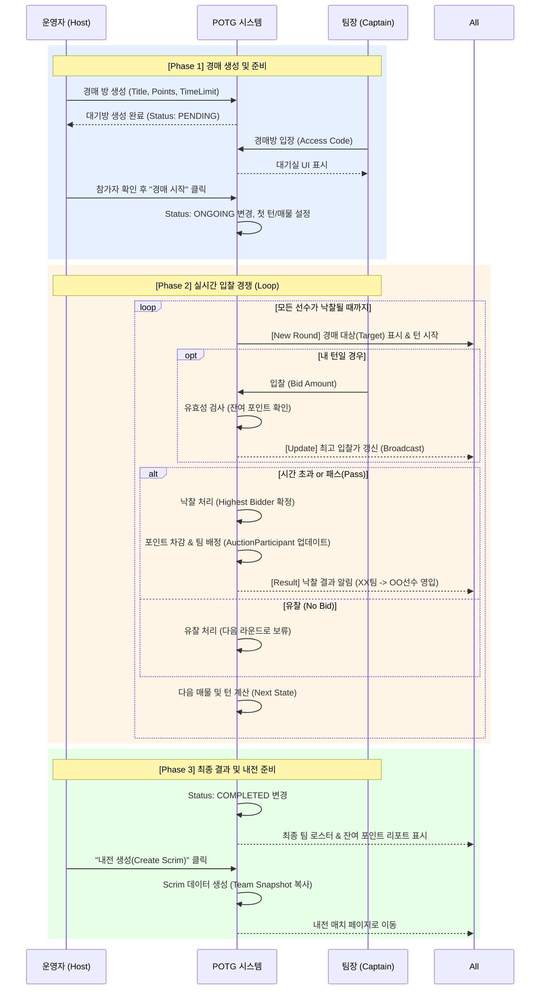
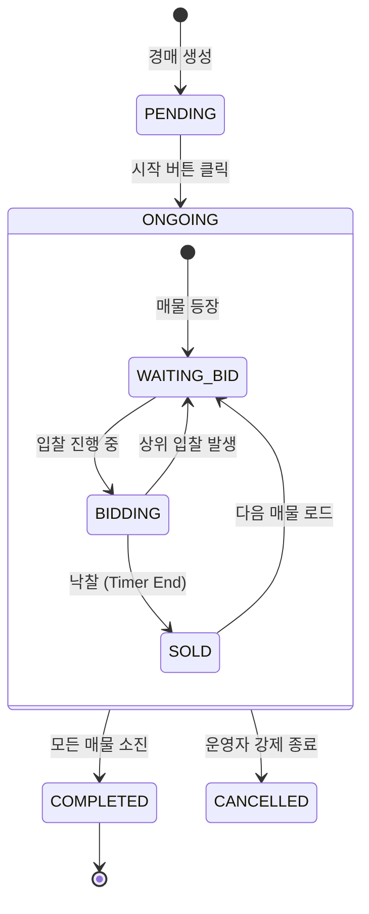

# 경매 시스템 프로세스 (Auction Process Flow)

이 문서는 경매 생성부터 종료까지 **운영자(Host)**와 **팀장(Captain)**의 상호작용 흐름을 정의합니다.

## 1. 전체 흐름도 (Sequence Flow)

## 2. 상태 전이 다이어그램 (State Transition)

경매 방(`Auction`)의 상태 변화는 다음과 같습니다.

