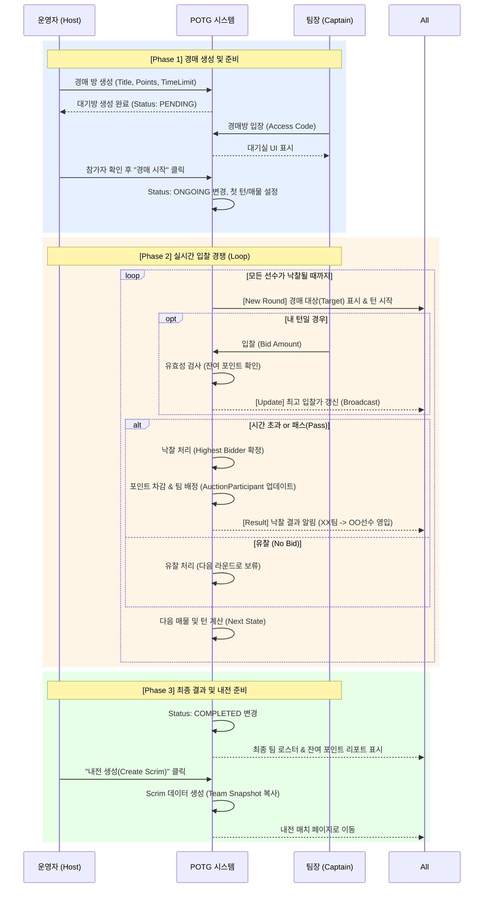
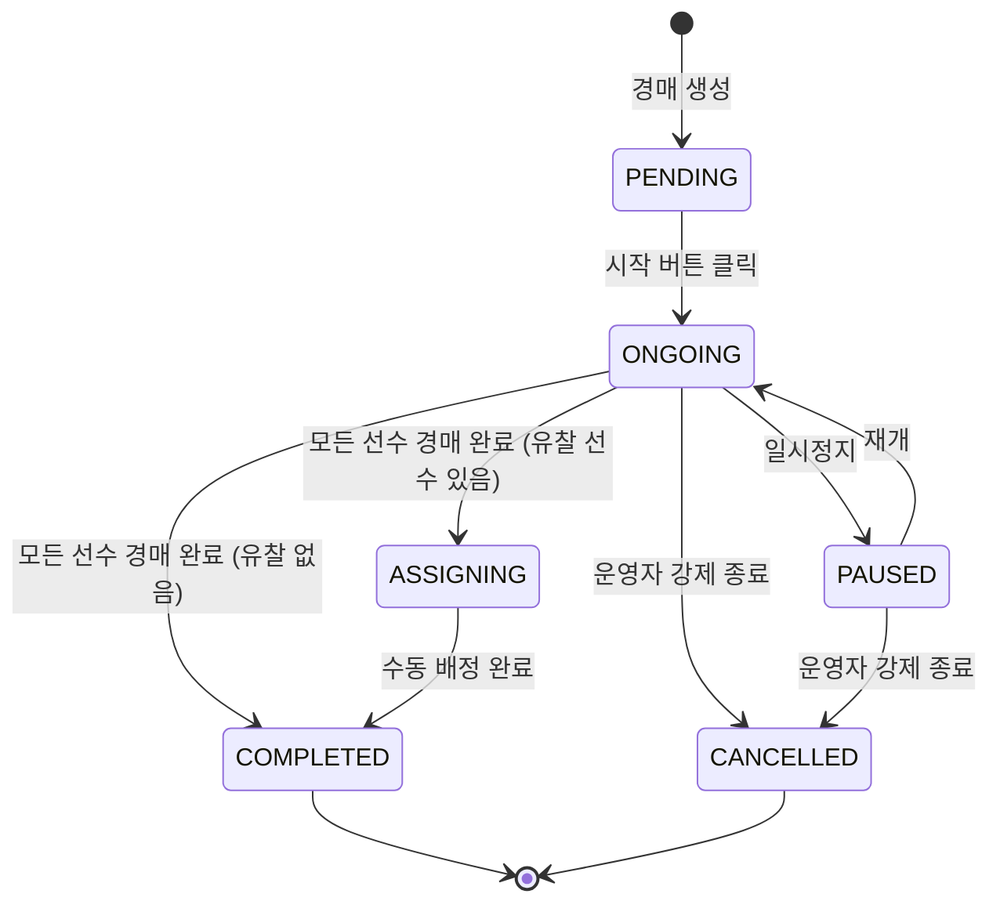
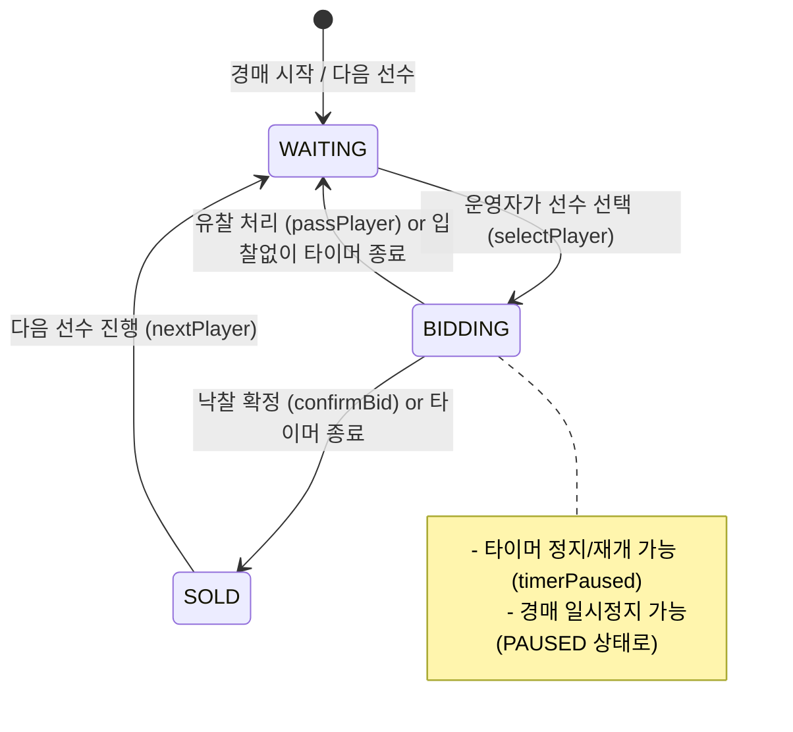

# 경매 시스템 프로세스 (Auction Process Flow)

이 문서는 경매 생성부터 종료까지 **운영자(Host)**와 **팀장(Captain)**의 상호작용 흐름을 정의합니다.

## 1. 전체 흐름도 (Sequence Flow)

## 2. 상태 전이 다이어그램 (State Transition)

경매 방(`Auction`)의 상태 변화는 다음과 같습니다.

### 2.1 경매 상태 (AuctionStatus)

### 2.2 입찰 단계 (BiddingPhase)

ONGOING 상태 내에서의 입찰 단계 전이:

## 3. WebSocket 이벤트 흐름

### 3.1 클라이언트 → 서버 (Emit)

| 이벤트 | 설명 | 권한 |
|--------|------|------|
| `joinRoom` | 경매방 입장 | 모든 참가자 |
| `startAuction` | 경매 시작 | Admin |
| `selectPlayer` | 선수 선택 (경매 대상) | Admin |
| `placeBid` | 입찰 | Captain |
| `confirmBid` | 낙찰 확정 | Admin |
| `passPlayer` | 유찰 처리 | Admin |
| `nextPlayer` | 다음 선수로 진행 | Admin |
| `pauseAuction` | 경매 일시정지 | Admin |
| `resumeAuction` | 경매 재개 | Admin |
| `pauseTimer` | 타이머 정지 | Admin |
| `resumeTimer` | 타이머 재개 | Admin |
| `undoSoldPlayer` | 낙찰 취소 | Admin |
| `enterAssignmentPhase` | 수동 배정 단계 진입 | Admin |
| `manualAssignPlayer` | 유찰 선수 수동 배정 | Admin |
| `completeAuction` | 경매 종료 | Admin |
| `createScrim` | 스크림 생성 | Admin |

### 3.2 서버 → 클라이언트 (Broadcast)

| 이벤트 | 설명 |
|--------|------|
| `roomState` | 전체 방 상태 동기화 |
| `timerUpdate` | 타이머 업데이트 (매초) |
| `bidPlaced` | 새 입찰 발생 |
| `bidConfirmed` | 낙찰 확정 |
| `playerPassed` | 유찰 처리됨 |
| `playerUndone` | 낙찰 취소됨 |
| `assignmentPhaseStarted` | 수동 배정 단계 시작 |
| `playerManuallyAssigned` | 선수 수동 배정됨 |
| `auctionCompleted` | 경매 종료 |
| `scrimCreated` | 스크림 생성됨 |
| `error` | 에러 발생 |
