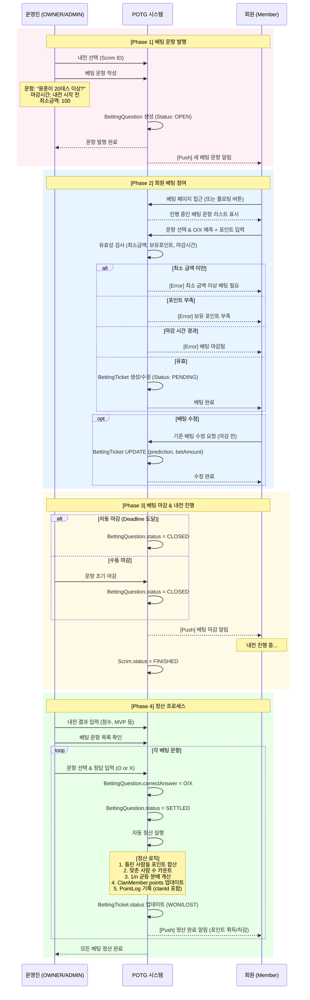
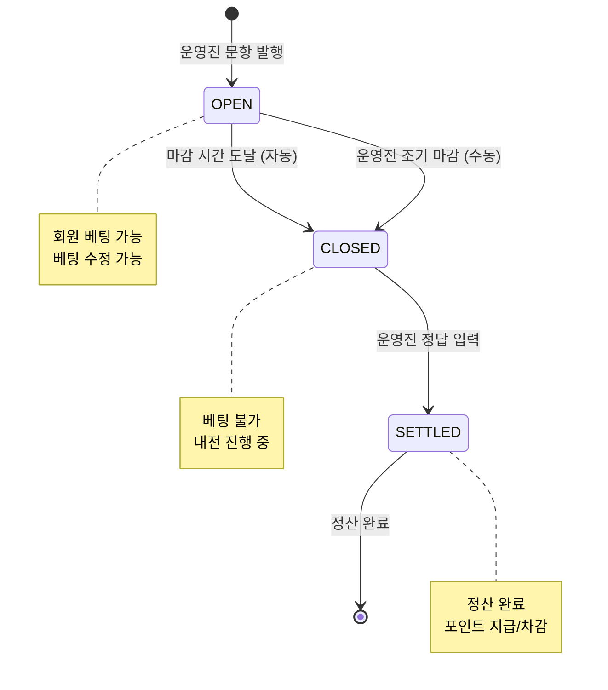
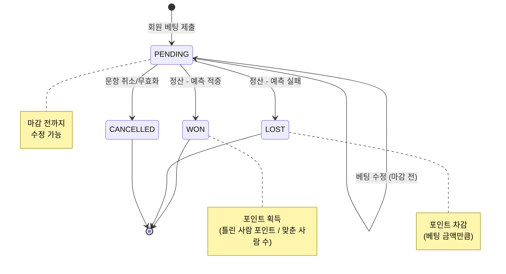

# 베팅 시스템 프로세스 (Betting System Process Flow)

이 문서는 베팅 문항 발행부터 정산까지 **운영진(OWNER/ADMIN)**, **회원(Member)**, **시스템**의 상호작용 흐름을 정의합니다.

## 1. 전체 흐름도 (Sequence Flow)



## 2. 베팅 문항 상태 전이 (BettingQuestion Status)



## 3. 베팅 티켓 상태 전이 (BettingTicket Status)



## 4. 정산 로직 (Settlement Logic)

### 정산 공식

```
맞춘 사람 보상 = Math.ceil(베팅 금액 × 배율)
틀린 사람 차감 = 베팅 금액
```

**배율(rewardMultiplier):** 문항 발행 시 운영진이 설정 (기본값: 2.0)
**소수점 처리:** 무조건 올림 (Math.ceil)

### 예시

**베팅 문항:** "용훈이 20데스 이상?" (정답: O, 배율: 2.0)

| 회원 | 예측 | 베팅 금액 | 결과 | 포인트 변동 |
|------|------|-----------|------|--------------|
| 회원A | O | 1000 | ✅ 적중 | +2000 |
| 회원B | O | 500 | ✅ 적중 | +1000 |
| 회원C | X | 300 | ❌ 실패 | -300 |
| 회원D | X | 700 | ❌ 실패 | -700 |

**정산 계산:**
- 회원A 보상: Math.ceil(1000 × 2.0) = 2000
- 회원B 보상: Math.ceil(500 × 2.0) = 1000
- 회원C 차감: 300
- 회원D 차감: 700

**결과:**
- 회원A: totalPoints += 2000, lockedPoints -= 1000
- 회원B: totalPoints += 1000, lockedPoints -= 500
- 회원C: totalPoints -= 300, lockedPoints -= 300
- 회원D: totalPoints -= 700, lockedPoints -= 700

### 소수점 올림 예시

**배율: 1.5**

| 베팅 금액 | 계산 | 올림 처리 | 최종 보상 |
|----------|------|----------|----------|
| 1000 | 1000 × 1.5 = 1500.0 | ceil(1500.0) | 1500 |
| 333 | 333 × 1.5 = 499.5 | ceil(499.5) | 500 |
| 100 | 100 × 1.5 = 150.0 | ceil(150.0) | 150 |
| 777 | 777 × 1.5 = 1165.5 | ceil(1165.5) | 1166 |

### 포인트 차감 시점

**베팅 제출 시 (즉시 차감):**
```typescript
ClanMember.lockedPoints += betAmount
// 가용 포인트 = totalPoints - lockedPoints
```

**정산 시:**
```typescript
// 맞춘 경우
보상 = Math.ceil(betAmount × rewardMultiplier)
ClanMember.totalPoints += 보상
ClanMember.lockedPoints -= betAmount

// 틀린 경우
ClanMember.totalPoints -= betAmount
ClanMember.lockedPoints -= betAmount
```

### 정산 트랜잭션 처리

```typescript
// 의사 코드
async function settleBettingQuestion(questionId: string) {
  const question = await findQuestion(questionId);
  const tickets = await findTickets(questionId);
  const scrim = await findScrim(question.scrimId); // clanId는 항상 존재 (NOT NULL)

  // 1. 분류
  const winners = tickets.filter(t => t.prediction === question.correctAnswer);
  const losers = tickets.filter(t => t.prediction !== question.correctAnswer);

  // 2. 포인트 업데이트 (Transaction)
  await db.transaction(async (trx) => {
    // 승자 처리
    for (const ticket of winners) {
      const reward = Math.ceil(ticket.betAmount * question.rewardMultiplier);

      // totalPoints 증가, lockedPoints 해제
      await updateClanMemberPoints(
        ticket.userId,
        scrim.clanId,
        { totalPoints: +reward, lockedPoints: -ticket.betAmount },
        trx
      );
      await createPointLog(ticket.userId, scrim.clanId, +reward, `베팅 승리: ${question.question}`, trx);
      await updateTicketStatus(ticket.id, 'WON', trx);
    }

    // 패자 처리
    for (const ticket of losers) {
      // totalPoints 차감, lockedPoints 해제
      await updateClanMemberPoints(
        ticket.userId,
        scrim.clanId,
        { totalPoints: -ticket.betAmount, lockedPoints: -ticket.betAmount },
        trx
      );
      await createPointLog(ticket.userId, scrim.clanId, -ticket.betAmount, `베팅 패배: ${question.question}`, trx);
      await updateTicketStatus(ticket.id, 'LOST', trx);
    }

    // 문항 상태 업데이트
    await updateQuestionStatus(questionId, 'SETTLED', trx);
  });
}
```

## 5. 클랜 포인트 관리

### 포인트 종속성

베팅으로 획득한 포인트는 **해당 클랜에서만 유효**합니다.

```
BettingTicket → BettingQuestion → Scrim → Clan
                                      ↓
                              ClanMember.points
                              (해당 클랜 내 포인트)
```

### 관련 엔티티

**ClanMember** (중간 테이블)
```typescript
{
  id: uuid
  clanId: uuid      // FK → Clan
  userId: uuid      // FK → User
  totalPoints: int  // 실제 보유 포인트 (정산 시 차감되는 진짜 포인트)
  lockedPoints: int // 베팅으로 잠긴 포인트
  penaltyCount: int
}

// 가용 포인트 계산
availablePoints = totalPoints - lockedPoints
```

**PointLog** (포인트 변동 이력)
```typescript
{
  id: uuid
  userId: uuid    // FK → User
  clanId: uuid    // FK → Clan (어떤 클랜의 포인트인가)
  amount: int     // 변동액 (+/-)
  reason: string  // 예: "베팅 승리: 용훈이 20데스 이상?"
  created_at: timestamp
}
```

### 다중 클랜 지원

한 사용자가 여러 클랜에 가입 가능하며, 각 클랜마다 독립적인 포인트를 보유합니다.

```
User (철수)
├─ ClanMember (A클랜) → points: 5000
└─ ClanMember (B클랜) → points: 3000

A클랜의 내전 베팅 승리 → A클랜 points만 증가
```

## 6. 주요 엔티티

### User
```typescript
{
  id: uuid
  battleTag: string
  // ... 기타 필드
  bettingFloatingEnabled: boolean  // 베팅 플로팅 버튼 사용 여부 (기본값: false)
  created_at: timestamp
  updated_at: timestamp
}
```

**베팅 접근 방식 설정:**
- `false` (기본값): 헤더 알림으로만 베팅 접근
- `true`: 플로팅 버튼 활성화 (모든 페이지에서 우측 하단 표시)

### BettingQuestion
```typescript
{
  id: uuid
  scrimId: uuid              // FK → Scrim (Scrim.clanId는 NOT NULL)
  creatorId: uuid            // FK → User (OWNER/ADMIN)
  question: string           // "용훈이 20데스 이상?"
  status: enum               // OPEN, CLOSED, SETTLED
  correctAnswer: enum        // O, X (Nullable)
  bettingDeadline: timestamp // Nullable (문항별 마감시간)
  minBetAmount: int          // 최소 베팅 금액 (기본값: 100)
  rewardMultiplier: float    // 보상 배율 (기본값: 2.0)
  created_at: timestamp
  updated_at: timestamp
}
```

### BettingTicket
```typescript
{
  id: uuid
  questionId: uuid         // FK → BettingQuestion
  userId: uuid             // FK → User
  prediction: enum         // O, X
  betAmount: int           // 베팅 포인트
  status: enum             // PENDING, WON, LOST, CANCELLED
  created_at: timestamp
  updated_at: timestamp

  // 제약: UNIQUE(questionId, userId) - 중복 방지
}
```

## 7. 주요 특징

### ✅ 독립적 접근성 (알림 통합 + 플로팅 옵션)
- 베팅은 Scrim에 종속되지만, 사용자는 어디서든 접근 가능
- **기본 방식: 헤더 알림 아이콘**
  - 진행중인 베팅 문항이 있으면 알림 뱃지 표시
  - 알림 드롭다운에서 "진행중인 베팅 N건" 확인 후 클릭 → 모달 오픈
  - 모바일 친화적 (헤더 아이콘 하나로 통합)
- **선택 방식: 플로팅 버튼** (`User.bettingFloatingEnabled = true`)
  - 설정에서 활성화 시 우측 하단에 플로팅 버튼 표시
  - 모든 페이지에서 플로팅 버튼 클릭 시 바로 모달 오픈
  - 빠른 접근을 원하는 사용자용
- 모달에서 진행중인 모든 베팅 문항을 바로 확인하고 베팅 가능
- 경매 관전, 디스코드 떠들면서도 언제든지 베팅 가능

### ✅ 유연한 문항 발행
- 한 내전에 여러 개의 베팅 문항 발행 가능
- 문항별 독립적 설정 (마감시간, 최소금액)
- 문항별 독립적 정산

### ✅ O/X 홀짝 방식
- 모든 베팅은 O 또는 X 중 선택
- 승/패도 결국 O/X (예: "A팀 승리?" → O/X)

### ✅ 수정 가능
- 마감 전까지 예측 및 베팅 금액 수정 가능
- UNIQUE 제약으로 중복 베팅 방지 (UPDATE만 허용)

### ✅ 자동 정산
- 운영진이 정답 입력 시 자동으로 포인트 분배
- 맞춘 사람: Math.ceil(베팅금액 × 배율) 보상
- 틀린 사람: 베팅금액 차감
- ClanMember.totalPoints/lockedPoints 업데이트 + PointLog 자동 기록

### ✅ 클랜별 포인트
- 베팅 포인트는 해당 클랜에서만 유효
- ClanMember 테이블로 클랜별 포인트 관리
- PointLog에 clanId 포함하여 이력 추적

## 8. 플로우차트 참고

- **회원 플로우:** [BETTING_FLOW.mmd](./BETTING_FLOW.mmd)
- **운영진 플로우:** [ADMIN_FLOW.mmd](./ADMIN_FLOW.mmd)
