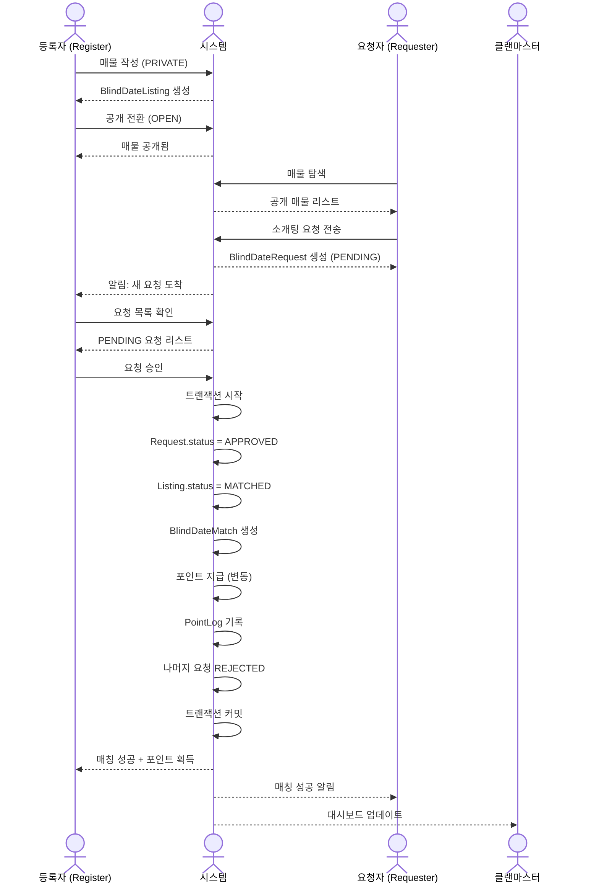
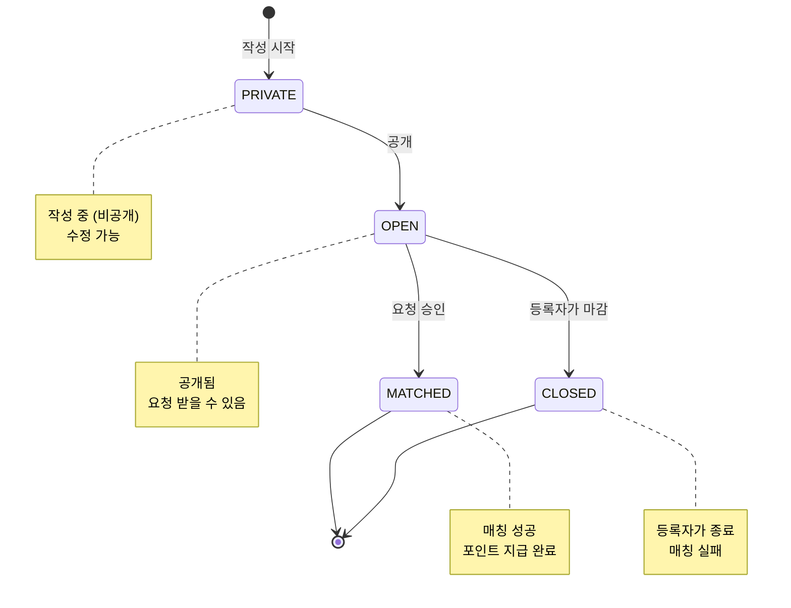
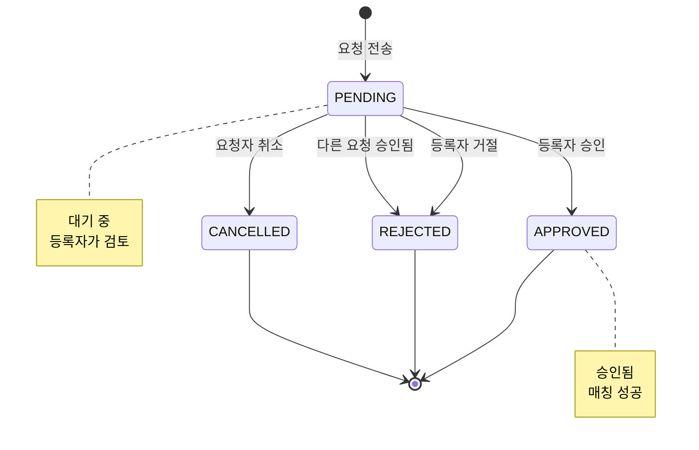

# 소개팅 시스템 프로세스 (Blind Date System Process)

클랜원이 본인 또는 지인을 "매물"로 등록하고, 다른 회원들이 요청 및 승인을 통해 매칭되는 시스템입니다.

---

## 전체 흐름도 (Sequence Flow)



---

## 상태 전이 다이어그램

### BlindDateListing (매물) 상태



### BlindDateRequest (요청) 상태



---

## 주요 엔티티

### BlindDateListing (소개팅 매물)

| 필드 | 타입 | 설명 |
|------|------|------|
| id | uuid | PK |
| clanId | uuid | FK - 소속 클랜 |
| registerId | uuid | FK - 등록자 (주선자) |
| status | enum | PRIVATE, OPEN, MATCHED, CLOSED |
| name | string | 이름 |
| age | int | 나이 |
| gender | enum | MALE, FEMALE |
| location | string | 거주지 |
| height | int | 키 (cm, Nullable) |
| job | string | 직업 |
| education | string | 학력 (Nullable) |
| description | text | 자기소개 |
| idealType | text | 희망 조건 |
| photos | jsonb | 사진 URL 배열 |
| contactInfo | string | 연락처 (Nullable) |
| matchedRequestId | uuid | FK - 매칭된 요청 (Nullable) |
| pointsEarned | int | 획득 포인트 (기본값: 0) |

**상태별 의미:**
- **PRIVATE**: 작성 중 (비공개, 수정 가능)
- **OPEN**: 공개됨 (요청 받을 수 있음)
- **MATCHED**: 매칭 성공 (포인트 지급 완료)
- **CLOSED**: 등록자가 마감 (매칭 실패)

### BlindDateRequest (소개팅 요청)

| 필드 | 타입 | 설명 |
|------|------|------|
| id | uuid | PK |
| listingId | uuid | FK - 매물 |
| requesterId | uuid | FK - 요청자 |
| clanId | uuid | FK - 클랜 |
| status | enum | PENDING, APPROVED, REJECTED, CANCELLED |
| message | text | 요청 메시지 (Nullable) |
| requesterInfo | jsonb | 요청자 정보 스냅샷 |

**상태별 의미:**
- **PENDING**: 대기 중 (등록자가 검토)
- **APPROVED**: 승인됨 (매칭 성공)
- **REJECTED**: 거절됨 (등록자가 거절 또는 다른 요청 승인됨)
- **CANCELLED**: 요청자가 취소

### BlindDateMatch (매칭 기록)

| 필드 | 타입 | 설명 |
|------|------|------|
| id | uuid | PK |
| listingId | uuid | FK - 매물 |
| requestId | uuid | FK - 승인된 요청 |
| clanId | uuid | FK - 클랜 |
| registerId | uuid | FK - 등록자 |
| requesterId | uuid | FK - 요청자 |
| pointsAwarded | int | 지급 포인트 |
| created_at | timestamp | 매칭 성공 시각 |

---

## 프로세스 상세

### Phase 1: 매물 등록

#### 1.1 매물 작성 (PRIVATE)

**등록자 작업:**
```typescript
async function createListing(data: CreateListingDto) {
  const listing = await db.blindDateListing.create({
    clanId: user.currentClanId,
    registerId: user.id,
    status: "PRIVATE",
    name: data.name,
    age: data.age,
    gender: data.gender,
    location: data.location,
    height: data.height,
    job: data.job,
    education: data.education,
    description: data.description,
    idealType: data.idealType,
    photos: data.photos || [],
    contactInfo: data.contactInfo,
    pointsEarned: 0
  });

  return listing;
}
```

**특징:**
- PRIVATE 상태로 시작
- 작성 중 수정 가능
- 공개 전까지 다른 회원에게 보이지 않음

#### 1.2 매물 공개 (OPEN)

**등록자 작업:**
```typescript
async function publishListing(listingId: string) {
  // 상태 체크
  const listing = await findListing(listingId);
  if (listing.status !== "PRIVATE") {
    throw new Error("비공개 상태에서만 공개할 수 있습니다.");
  }

  // 필수 정보 체크
  if (!listing.name || !listing.age || !listing.description) {
    throw new Error("필수 정보를 모두 입력해주세요.");
  }

  // 공개 전환
  await updateListing(listingId, { status: "OPEN" });

  // 클랜 전체 알림 (선택)
  await notifyClan(listing.clanId, "새로운 소개팅 매물이 등록되었습니다.");
}
```

---

### Phase 2: 요청 및 승인

#### 2.1 매물 탐색

**요청자 작업:**
```typescript
async function findOpenListings(clanId: string, filters?: ListingFilter) {
  const listings = await db.blindDateListing.findMany({
    where: {
      clanId,
      status: "OPEN",
      // 필터 적용
      ...(filters?.gender && { gender: filters.gender }),
      ...(filters?.minAge && { age: { gte: filters.minAge } }),
      ...(filters?.maxAge && { age: { lte: filters.maxAge } }),
      ...(filters?.location && { location: filters.location })
    },
    include: {
      register: {
        select: { battleTag: true }
      }
    }
  });

  return listings;
}
```

**필터 옵션:**
- 성별
- 나이 범위
- 거주지
- 직업
- 키 범위 등

#### 2.2 소개팅 요청

**요청자 작업:**
```typescript
async function createRequest(listingId: string, userId: string, message?: string) {
  const listing = await findListing(listingId);

  // 상태 체크
  if (listing.status !== "OPEN") {
    throw new Error("현재 요청할 수 없는 매물입니다.");
  }

  // 본인 확인
  if (listing.registerId === userId) {
    throw new Error("본인이 등록한 매물에는 요청할 수 없습니다.");
  }

  // 중복 요청 체크
  const existingRequest = await findRequest({
    listingId,
    requesterId: userId,
    status: "PENDING"
  });

  if (existingRequest) {
    throw new Error("이미 요청한 매물입니다.");
  }

  // 요청자 정보 스냅샷
  const user = await findUser(userId);
  const requesterInfo = {
    battleTag: user.battleTag,
    age: user.age,
    job: user.job,
    // ... 기타 정보
  };

  // 요청 생성
  const request = await db.blindDateRequest.create({
    listingId,
    requesterId: userId,
    clanId: listing.clanId,
    status: "PENDING",
    message,
    requesterInfo
  });

  // 등록자에게 알림
  await notifyUser(listing.registerId, "새로운 소개팅 요청이 도착했습니다.");

  return request;
}
```

#### 2.3 요청 승인

**등록자 작업:**
```typescript
async function approveRequest(requestId: string, registerId: string) {
  await db.transaction(async (trx) => {
    // 요청 조회 (Row Lock)
    const request = await trx.blindDateRequest
      .where({ id: requestId })
      .forUpdate()
      .first();

    if (!request) {
      throw new Error("요청을 찾을 수 없습니다.");
    }

    // 매물 조회 (Row Lock)
    const listing = await trx.blindDateListing
      .where({ id: request.listingId })
      .forUpdate()
      .first();

    // 권한 체크
    if (listing.registerId !== registerId) {
      throw new Error("권한이 없습니다.");
    }

    // 상태 체크
    if (listing.status !== "OPEN") {
      throw new Error("이미 매칭되었거나 종료된 매물입니다.");
    }

    if (request.status !== "PENDING") {
      throw new Error("이미 처리된 요청입니다.");
    }

    // 1. 요청 승인
    await trx.blindDateRequest
      .where({ id: requestId })
      .update({ status: "APPROVED", updated_at: new Date() });

    // 2. 포인트 계산 (변동)
    const pointsAwarded = calculateBlindDatePoints(listing);

    // 3. 매물 매칭 처리
    await trx.blindDateListing
      .where({ id: listing.id })
      .update({
        status: "MATCHED",
        matchedRequestId: requestId,
        pointsEarned: pointsAwarded,
        updated_at: new Date()
      });

    // 4. 매칭 기록 생성
    await trx.blindDateMatch.create({
      listingId: listing.id,
      requestId,
      clanId: listing.clanId,
      registerId: listing.registerId,
      requesterId: request.requesterId,
      pointsAwarded
    });

    // 5. 포인트 지급
    await trx.clanMember
      .where({ userId: registerId, clanId: listing.clanId })
      .increment("totalPoints", pointsAwarded);

    // 6. 포인트 로그
    await trx.pointLog.create({
      userId: registerId,
      clanId: listing.clanId,
      amount: pointsAwarded,
      reason: `소개팅 매칭 성공: ${listing.name}`
    });

    // 7. 나머지 요청 자동 거절
    await trx.blindDateRequest
      .where({
        listingId: listing.id,
        status: "PENDING"
      })
      .whereNot({ id: requestId })
      .update({ status: "REJECTED", updated_at: new Date() });
  });

  // 알림
  await notifyUser(request.requesterId, "소개팅 요청이 승인되었습니다!");
}
```

#### 2.4 요청 거절

**등록자 작업:**
```typescript
async function rejectRequest(requestId: string, registerId: string) {
  const request = await findRequest(requestId);
  const listing = await findListing(request.listingId);

  // 권한 체크
  if (listing.registerId !== registerId) {
    throw new Error("권한이 없습니다.");
  }

  // 상태 체크
  if (request.status !== "PENDING") {
    throw new Error("이미 처리된 요청입니다.");
  }

  // 거절 처리
  await updateRequest(requestId, { status: "REJECTED" });

  // 알림 (선택)
  await notifyUser(request.requesterId, "소개팅 요청이 거절되었습니다.");
}
```

---

### Phase 3: 매칭 및 포인트 지급

#### 3.1 포인트 계산 로직 (변동)

```typescript
function calculateBlindDatePoints(listing: BlindDateListing): number {
  let basePoints = 500; // 기본 포인트

  // 나이에 따른 가산점 (예시)
  if (listing.age >= 35) {
    basePoints += 200; // 고연령 보너스
  }

  // 성별 수급 불균형 고려 (예시)
  const genderDemand = await getGenderDemand(listing.clanId, listing.gender);
  if (genderDemand === "HIGH") {
    basePoints += 300; // 수요 높은 성별
  }

  // 스펙 가산점 (예시)
  if (listing.education?.includes("대졸") || listing.education?.includes("대학원")) {
    basePoints += 100;
  }

  if (listing.job?.includes("전문직") || listing.job?.includes("공무원")) {
    basePoints += 100;
  }

  // 사진 개수
  const photoCount = listing.photos?.length || 0;
  if (photoCount >= 3) {
    basePoints += 50;
  }

  return basePoints;
}
```

**포인트 지급 예시:**
- 기본: 500P
- 35세 이상: +200P
- 수요 높은 성별: +300P
- 대졸 이상: +100P
- 전문직: +100P
- 사진 3장 이상: +50P
- **총:** 500 ~ 1,250P

---

## 주요 특징

### 1. 다중 요청 처리

- 한 매물이 동시에 여러 요청을 받을 수 있음
- 등록자가 여러 요청 중 선택 가능
- 승인 시 나머지 요청 자동 거절

### 2. 요청자 정보 스냅샷

```typescript
interface RequesterInfo {
  battleTag: string;
  age?: number;
  job?: string;
  location?: string;
  // ... 기타 정보
}
```

- 요청 생성 시 요청자 정보 저장
- User 정보 변경되어도 요청 당시 정보 유지
- 등록자가 요청자 정보 확인 가능

### 3. 포인트 생태계 통합

**포인트 획득:**
- 베팅 승리
- 경매 수익
- **소개팅 매칭 성공** ← 새로운 획득 수단

**포인트 사용:**
- 베팅
- 경매 입찰
- **상점 구매** (Shop 시스템)

### 4. 매칭 대시보드

**통계 정보:**
```typescript
interface BlindDateStats {
  totalListings: number;           // 총 매물 수
  totalMatches: number;             // 총 매칭 수
  successRate: number;              // 매칭 성공률
  topRegisters: RegisterRanking[]; // 매칭 많이 시킨 회원
  popularGender: "MALE" | "FEMALE"; // 인기 성별
  averagePoints: number;            // 평균 지급 포인트
}
```

**공개 정보:**
- 누가 누구를 매칭시켰는지 (등록자 + 매물 이름)
- 언제 매칭되었는지
- 얼마의 포인트를 받았는지

---

## 엣지 케이스 처리

### 1. 동시 승인 방지 (Race Condition)

```typescript
// Row Lock 사용
await trx.blindDateListing
  .where({ id: listingId })
  .forUpdate()
  .first();

// 상태 체크
if (listing.status !== "OPEN") {
  throw new Error("이미 매칭되었거나 종료된 매물입니다.");
}
```

### 2. 매물 삭제 정책

```typescript
async function deleteListing(listingId: string) {
  const listing = await findListing(listingId);

  // OPEN 상태에서 PENDING 요청 있으면 삭제 불가
  if (listing.status === "OPEN") {
    const pendingRequests = await findRequests({
      listingId,
      status: "PENDING"
    });

    if (pendingRequests.length > 0) {
      throw new Error(
        "대기 중인 요청이 있어 삭제할 수 없습니다. 먼저 모든 요청을 처리해주세요."
      );
    }
  }

  // MATCHED 상태는 삭제 불가 (기록 보존)
  if (listing.status === "MATCHED") {
    throw new Error("매칭된 매물은 삭제할 수 없습니다.");
  }

  await db.blindDateListing.delete({ id: listingId });
}
```

### 3. 클랜 탈퇴 처리

```typescript
async function leaveClan(userId: string, clanId: string) {
  // OPEN 상태 매물 체크
  const openListings = await findListings({
    registerId: userId,
    clanId,
    status: "OPEN"
  });

  if (openListings.length > 0) {
    throw new Error(
      "공개 중인 소개팅 매물이 있어 탈퇴할 수 없습니다. 먼저 매물을 마감해주세요."
    );
  }

  // PENDING 요청 체크
  const pendingRequests = await findRequests({
    requesterId: userId,
    clanId,
    status: "PENDING"
  });

  if (pendingRequests.length > 0) {
    throw new Error(
      "대기 중인 소개팅 요청이 있어 탈퇴할 수 없습니다. 먼저 요청을 취소해주세요."
    );
  }

  // 탈퇴 진행...
}
```

### 4. 본인 요청 방지

```typescript
if (listing.registerId === userId) {
  throw new Error("본인이 등록한 매물에는 요청할 수 없습니다.");
}
```

### 5. 중복 요청 방지

```typescript
const existingRequest = await findRequest({
  listingId,
  requesterId: userId,
  status: "PENDING"
});

if (existingRequest) {
  throw new Error("이미 요청한 매물입니다.");
}
```

---

## API 엔드포인트 예시

### Listing 관련

```
POST   /api/clans/:clanId/blind-date/listings          # 매물 작성
PATCH  /api/clans/:clanId/blind-date/listings/:id      # 매물 수정
PATCH  /api/clans/:clanId/blind-date/listings/:id/publish  # 공개
PATCH  /api/clans/:clanId/blind-date/listings/:id/close    # 마감
DELETE /api/clans/:clanId/blind-date/listings/:id      # 삭제
GET    /api/clans/:clanId/blind-date/listings          # 공개 매물 리스트
GET    /api/clans/:clanId/blind-date/listings/my       # 내 매물
GET    /api/clans/:clanId/blind-date/listings/:id      # 매물 상세
```

### Request 관련

```
POST   /api/clans/:clanId/blind-date/requests          # 요청 전송
PATCH  /api/clans/:clanId/blind-date/requests/:id/approve  # 승인
PATCH  /api/clans/:clanId/blind-date/requests/:id/reject   # 거절
PATCH  /api/clans/:clanId/blind-date/requests/:id/cancel   # 취소
GET    /api/clans/:clanId/blind-date/requests/received     # 받은 요청
GET    /api/clans/:clanId/blind-date/requests/sent         # 보낸 요청
```

### 통계

```
GET    /api/clans/:clanId/blind-date/stats             # 통계
GET    /api/clans/:clanId/blind-date/matches           # 매칭 내역
GET    /api/clans/:clanId/blind-date/rankings          # 랭킹
```

---

## 관련 문서

- **플로우차트:** [FLOW.mmd](./FLOW.mmd)
- **등록자 플로우:** [REGISTER_FLOW.mmd](./REGISTER_FLOW.mmd)
- **요청자 플로우:** [REQUESTER_FLOW.mmd](./REQUESTER_FLOW.mmd)
- **엣지 케이스 시뮬레이션:** [SIMULATION.md](./SIMULATION.md)
- **ERD:** [docs/common/ERD.mmd](../common/ERD.mmd)
