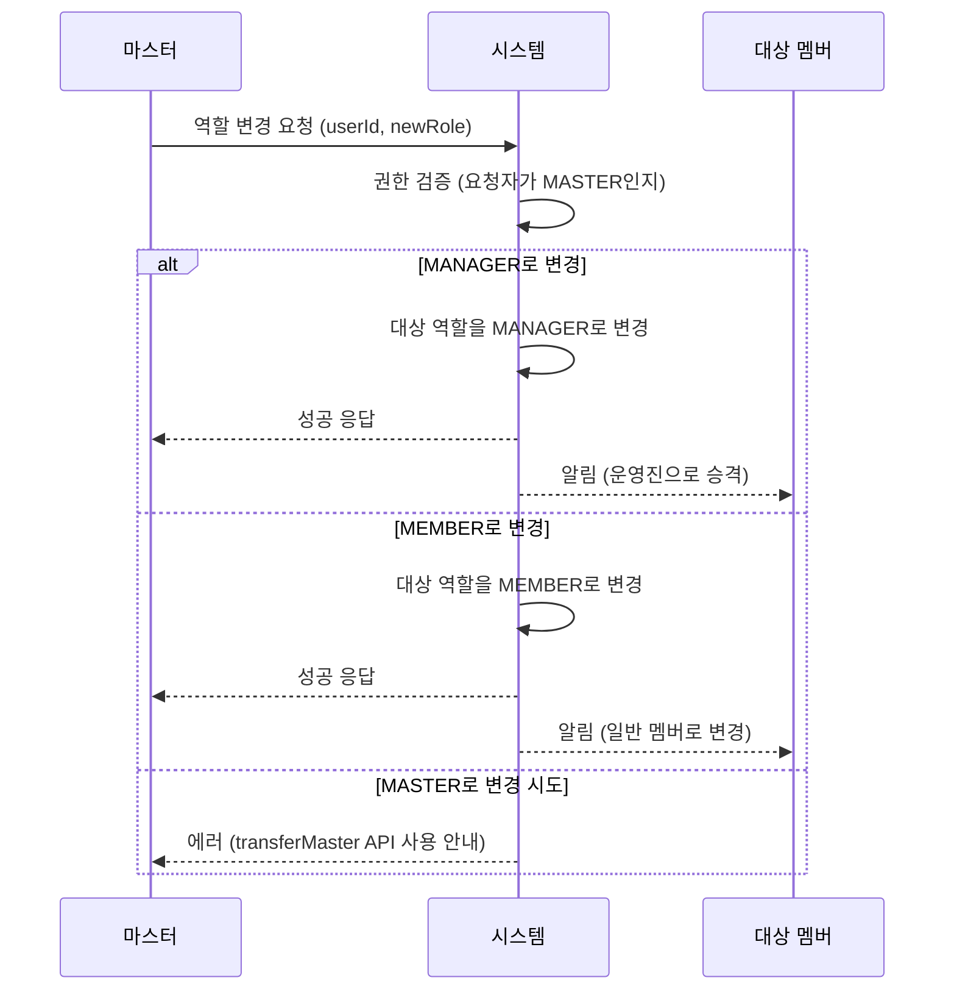
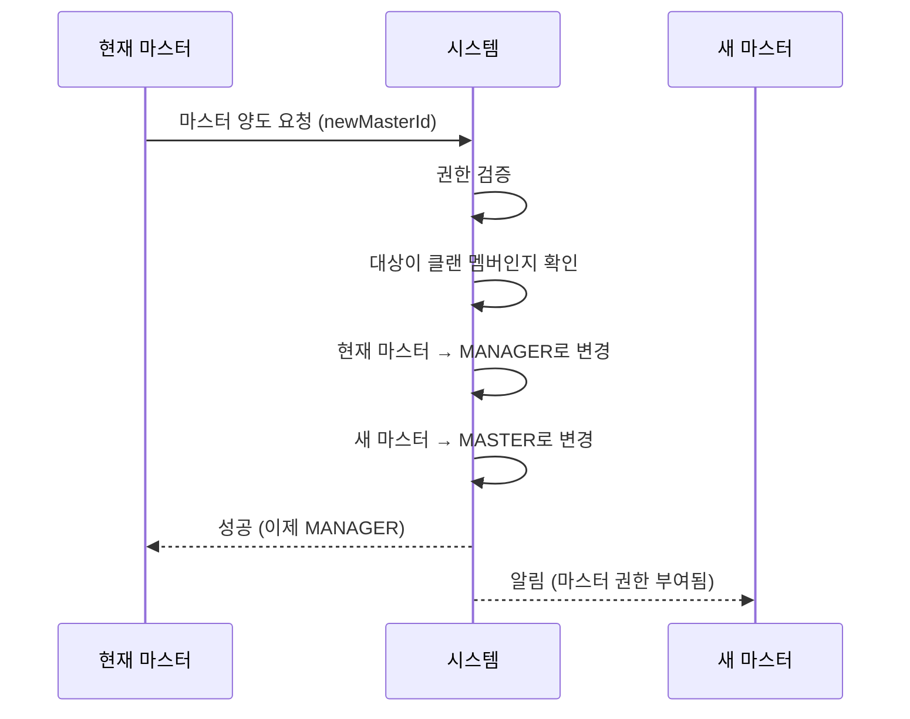
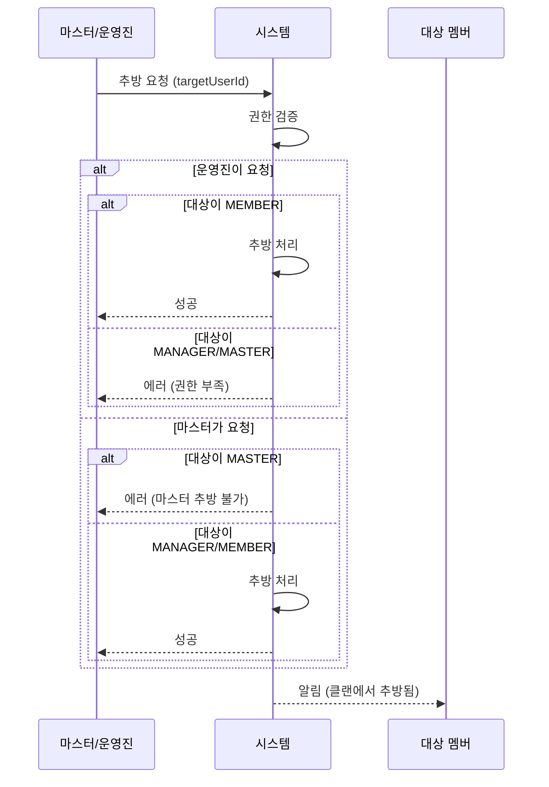

# 클랜 관리 프로세스 (Clan Management Process)

## 1. 역할 체계 (Role Hierarchy)

### 1.1 시스템 역할 (UserRole)
| 역할 | 설명 | 권한 범위 |
|------|------|----------|
| **ADMIN** | POTG 시스템 관리자 | 모든 클랜에 대한 전체 권한 |
| **USER** | 일반 사용자 | 소속 클랜 내 권한만 |

### 1.2 클랜 역할 (ClanRole)
| 역할 | 설명 | 권한 |
|------|------|------|
| **MASTER** | 클랜 마스터 (생성자/양도받은 자) | 클랜 내 모든 권한 |
| **MANAGER** | 운영진 | 투표/스크림/경매/상품/베팅 CRUD |
| **MEMBER** | 일반 멤버 | 참여만 가능 |

## 2. 권한 매트릭스 (Permission Matrix)

| 기능 | ADMIN | MASTER | MANAGER | MEMBER |
|------|-------|--------|---------|--------|
| **클랜 관리** |
| 클랜 삭제 | ✅ | ✅ | ❌ | ❌ |
| 멤버 추방 | ✅ | ✅ | ✅ (MEMBER만) | ❌ |
| 역할 변경 | ✅ | ✅ | ❌ | ❌ |
| 마스터 양도 | ✅ | ✅ | ❌ | ❌ |
| 가입 승인/거절 | ✅ | ✅ | ✅ | ❌ |
| **투표 (Vote)** |
| 생성/수정/삭제 | ✅ | ✅ | ✅ | ❌ |
| 참여 | ✅ | ✅ | ✅ | ✅ |
| **스크림 (Scrim)** |
| 생성/수정/삭제 | ✅ | ✅ | ✅ | ❌ |
| 결과 입력 | ✅ | ✅ | ✅ | ❌ |
| 참여 | ✅ | ✅ | ✅ | ✅ |
| **경매 (Auction)** |
| 경매 생성 | ✅ | ✅ | ✅ | ❌ |
| 경매 마스터 (진행) | ✅ | ✅ | ✅ | ❌ |
| 매물 등록 (다른 멤버) | ✅ | ✅ | ✅ | ❌ |
| 팀 생성/삭제 | ✅ | ✅ | ✅ | ❌ |
| 참여 (팀장/선수) | ✅ | ✅ | ✅ | ✅ |
| **상점 (Shop)** |
| 상품 등록/수정/삭제 | ✅ | ✅ | ✅ | ❌ |
| 구매 승인 | ✅ | ✅ | ✅ | ❌ |
| 구매 | ✅ | ✅ | ✅ | ✅ |
| **베팅 (Betting)** |
| 베팅 문제 생성 | ✅ | ✅ | ✅ | ❌ |
| 베팅 정산 | ✅ | ✅ | ✅ | ❌ |
| 베팅 참여 | ✅ | ✅ | ✅ | ✅ |

## 3. 클랜 관리 API

### 3.1 멤버 관리
```
GET    /clans/:clanId/members          # 멤버 목록 조회
PATCH  /clans/:clanId/members/:userId/role  # 역할 변경 (MASTER만)
POST   /clans/:clanId/members/:userId/kick  # 멤버 추방 (MASTER, MANAGER)
POST   /clans/:clanId/transfer-master   # 마스터 권한 양도 (MASTER만)
```

### 3.2 가입 관리
```
GET    /clans/:clanId/requests         # 가입 신청 목록
POST   /clans/requests/:id/approve     # 승인
POST   /clans/requests/:id/reject      # 거절
```

## 4. 플로우 다이어그램

### 4.1 역할 변경 플로우



### 4.2 마스터 양도 플로우



### 4.3 멤버 추방 플로우



## 5. 프론트엔드 UI 구조

```
/clan/manage
├── 탭: 가입 신청 (현재 구현됨)
├── 탭: 멤버 관리 (NEW)
│   ├── 멤버 목록 (역할별 그룹화)
│   ├── 역할 변경 드롭다운 (MASTER만 표시)
│   ├── 추방 버튼 (권한에 따라 표시)
│   └── 마스터 양도 버튼 (MASTER만 표시)
└── 탭: 클랜 설정 (NEW)
    ├── 클랜 정보 수정
    └── 클랜 삭제 (MASTER만)
```
