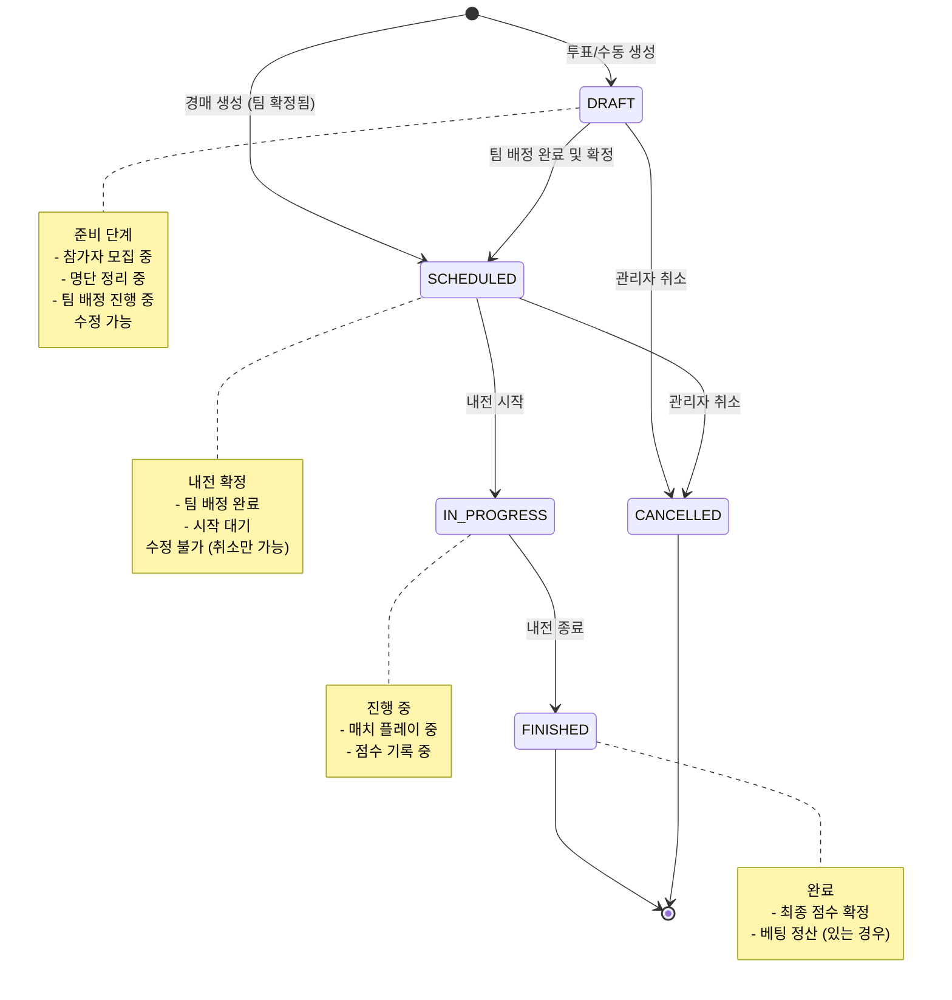

# 내전 (Scrim) 시스템 프로세스 (Scrim Management Process)

이 문서는 내전 생성, 참가자 관리, 팀 배정, 매치 진행의 전체 라이프사이클을 정의합니다.

## 1. 내전 생성 방식 (3가지)

POTG 시스템은 3가지 내전 생성 방식을 지원합니다:

| 방식 | recruitmentType | 특징 | 초기 상태 | 팀 배정 |
|------|-----------------|------|-----------|---------|
| **투표 기반** | `VOTE` | 클랜원 투표 → 명단 정리 → 수동 팀 배정 | DRAFT | 수동 |
| **경매 기반** | `AUCTION` | 경매로 팀 구성 → 자동 내전 생성 | SCHEDULED | 자동 |
| **수동 생성** | `MANUAL` | 관리자가 직접 참가자 선택 및 팀 배정 | DRAFT | 수동 |

---

## 2. 내전 상태 전이 (Scrim Status Lifecycle)



---

## 3. 생성 방식별 상세 프로세스

### 3.1 투표 기반 (VOTE)

**특징:**
- 비선형 타임라인 지원 (투표 마감 후 며칠 뒤 내전 생성)
- 유연한 참가자 관리 (추가/제외 가능)
- 수동 팀 배정 (관리자가 밸런스 조정)

**프로세스:**
```
1. Vote 생성 및 마감
   → Vote.status = CLOSED

2. 내전 생성 (DRAFT)
   → Scrim 생성 (recruitmentType: VOTE, voteId 참조)
   → ScrimParticipant 자동 생성 (source: VOTE)

3. 명단 정리
   → 참가자 추가 (source: MANUAL)
   → 참가자 제외 (status: REMOVED)
   → 늦참자 벤치 배정 (assignedTeam: BENCH)

4. 팀 배정
   → 관리자가 드래그앤드롭으로 TEAM_A/B 배정
   → ScrimParticipant.assignedTeam 업데이트

5. 내전 확정
   → Scrim.status = SCHEDULED
   → teamSnapshot 생성 및 저장

6. 내전 진행
   → IN_PROGRESS → FINISHED
```

**관련 문서:** [docs/vote/PROCESS.md](../vote/PROCESS.md)

---

### 3.2 경매 기반 (AUCTION)

**특징:**
- 경매로 선수 낙찰 → 참가자 명단 집계까지만 자동
- **팀 생성 및 배정은 내전 마스터가 수동 제어**
- 경매 결과를 참고하여 마스터가 팀 구성

**프로세스:**
```
1. Auction 생성 및 진행
   → 입찰로 선수 낙찰
   → AuctionParticipant.teamId 설정 (어느 팀장에게 낙찰됐는지)
   → Auction.status = COMPLETED

2. 내전 생성 버튼 활성화
   → 마스터 클릭 → 내전 생성 (DRAFT)
   → Scrim 생성 (recruitmentType: AUCTION, auctionId 참조)
   → ScrimParticipant 자동 생성 (source: AUCTION)
   → assignedTeam = UNASSIGNED (아직 배정 안 됨)

3. 팀 배정 (수동 - 마스터가 직접)
   → 경매 낙찰 결과 참고
   → 마스터가 TEAM_A, TEAM_B로 배정
   → Scrim.status = SCHEDULED
   → teamSnapshot 생성

4. 내전 진행
   → IN_PROGRESS → FINISHED
```

**명단 집계 로직 (자동화는 여기까지만):**
```typescript
async function createScrimFromAuction(auctionId: string) {
  const auction = await findAuction(auctionId);
  const participants = await findAuctionParticipants(auctionId);

  // 내전 생성 (DRAFT 상태)
  const scrim = await createScrim({
    auctionId,
    recruitmentType: "AUCTION",
    status: "DRAFT",  // 팀 배정 전이므로 DRAFT
    title: `${auction.title} - 내전`,
    scheduledDate: auction.scheduledDate
  });

  // ScrimParticipant 생성 (명단 집계만, 팀 배정은 아직 안 함)
  for (const participant of participants) {
    if (participant.role === "SPECTATOR") continue;

    await createScrimParticipant({
      scrimId: scrim.id,
      userId: participant.userId,
      source: "AUCTION",
      status: "CONFIRMED",
      assignedTeam: "UNASSIGNED",  // 마스터가 수동 배정할 때까지 미배정
      // 참고용: participant.teamId (어느 팀장에게 낙찰됐는지)
    });
  }

  // 이후 마스터가 수동으로:
  // 1. 경매 결과(teamId) 참고
  // 2. TEAM_A, TEAM_B 드래그앤드롭 배정
  // 3. Scrim.status = SCHEDULED
  // 4. teamSnapshot 생성
}
```

**관련 문서:** [docs/auction/PROCESS.md](../auction/PROCESS.md)

---

### 3.3 수동 생성 (MANUAL)

**특징:**
- 투표/경매 없이 관리자가 직접 생성
- 빠른 내전 구성 가능 (친선전, 테스트 등)
- 참가자 선택부터 팀 배정까지 모두 수동

**프로세스:**
```
1. 내전 생성 (DRAFT)
   → Scrim 생성 (recruitmentType: MANUAL)

2. 참가자 수동 추가
   → ScrimParticipant 생성 (source: MANUAL)

3. 팀 배정
   → 드래그앤드롭으로 TEAM_A/B 배정

4. 내전 확정
   → Scrim.status = SCHEDULED
   → teamSnapshot 생성

5. 내전 진행
   → IN_PROGRESS → FINISHED
```

**사용 예시:**
- 친선전 (다른 클랜과의 교류전)
- 테스트 내전
- 특정 멤버만 초대하는 소규모 내전

---

## 4. ScrimParticipant 관리

### 4.1 ScrimParticipant란?

**역할:** 내전 참가자 풀 관리
- 누가 내전에 참가하는가?
- 어떤 경로로 참가했는가? (투표/경매/수동)
- 어느 팀에 배정되었는가?
- 참가 상태는? (확정/대기/제외 등)

**주요 필드:**
```typescript
{
  id: uuid
  scrimId: uuid              // FK → Scrim
  userId: uuid               // FK → User
  source: enum               // VOTE, AUCTION, MANUAL
  status: enum               // PENDING, CONFIRMED, BENCH, DECLINED, REMOVED
  assignedTeam: enum         // TEAM_A, TEAM_B, BENCH, UNASSIGNED
  created_at: timestamp
  updated_at: timestamp
}
```

### 4.2 source (참가 경로)

| source | 설명 | 생성 시점 |
|--------|------|-----------|
| `VOTE` | 투표로 "참석" 선택 | 내전 생성 시 자동 생성 |
| `AUCTION` | 경매에서 낙찰됨 | 내전 생성 시 자동 생성 |
| `MANUAL` | 관리자가 수동 추가 | 관리자가 추가할 때 |

### 4.3 status (참가 상태)

| status | 의미 | 사용 시점 |
|--------|------|-----------|
| `PENDING` | 임시 참가 (확정 대기) | 초기 등록 시 (거의 사용 안 함) |
| `CONFIRMED` | 참가 확정 | 대부분의 참가자 (팀 배정 가능) |
| `BENCH` | 벤치 멤버 (교체 대기) | 늦참자, 교체 선수 |
| `DECLINED` | 본인이 참가 취소 | 참가 확정 후 본인이 거부 |
| `REMOVED` | 관리자가 제외 | 명단 정리 시 제외 |

### 4.4 assignedTeam (팀 배정)

| assignedTeam | 의미 | 사용 시점 |
|--------------|------|-----------|
| `TEAM_A` | A팀 | 팀 배정 완료 |
| `TEAM_B` | B팀 | 팀 배정 완료 |
| `BENCH` | 벤치 | 늦참자, 교체 선수 |
| `UNASSIGNED` | 미배정 | 팀 배정 전 (DRAFT 상태) |

---

## 5. ScrimMatchEntry vs ScrimParticipant

**두 엔티티의 차이:**

| 구분 | ScrimParticipant | ScrimMatchEntry |
|------|------------------|-----------------|
| **레벨** | Scrim (내전 전체) | ScrimMatch (매치별) |
| **목적** | 내전 참가자 풀 관리 | 매치별 실제 출전자 기록 |
| **생성 시점** | 내전 생성 시 (DRAFT) | 매치 시작 시 |
| **관계** | Scrim 1:N ScrimParticipant | ScrimMatch 1:N ScrimMatchEntry |
| **팀 정보** | assignedTeam (전체 내전 기준) | team (해당 매치만) |
| **교체** | 변경 불가 (확정 후) | 매치별로 다를 수 있음 |

**예시:**
```typescript
// ScrimParticipant (내전 로스터)
Scrim "12월 15일 5vs5 내전" {
  participants: [
    { userId: "A", assignedTeam: "TEAM_A" },  // 전체 내전 로스터
    { userId: "B", assignedTeam: "TEAM_A" },
    { userId: "C", assignedTeam: "BENCH" },   // 벤치 (교체 대기)
    // ...
  ]
}

// ScrimMatchEntry (매치별 출전자)
ScrimMatch "1세트 - Lijang Tower" {
  entries: [
    { userId: "A", team: "TEAM_A" },  // 실제 출전
    { userId: "B", team: "TEAM_A" },
    // C는 이번 매치에 출전 안 함 (벤치)
  ]
}

ScrimMatch "2세트 - Ilios" {
  entries: [
    { userId: "C", team: "TEAM_A" },  // C 교체 투입
    { userId: "B", team: "TEAM_A" },
    // A는 이번 매치에 쉬고 C가 투입됨
  ]
}
```

**사용 사례:**
- ScrimParticipant: "이 내전에 누가 참가하나요?"
- ScrimMatchEntry: "이 매치에 누가 실제로 플레이했나요?"

---

## 6. teamSnapshot 구조

**목적:** 내전 확정 시점의 팀 구성을 스냅샷으로 저장

**타입:** `jsonb` (JSON Binary)

**스키마:** [TEAM_SNAPSHOT_SCHEMA.md](./TEAM_SNAPSHOT_SCHEMA.md) 참조

**예시:**
```json
{
  "recruitmentType": "vote",
  "sourceId": "vote-uuid",
  "teamA": {
    "players": [
      {
        "userId": "user-1",
        "battleTag": "Player1#1234",
        "role": "TANK",
        "rating": 3500
      },
      // ...
    ]
  },
  "teamB": { /* 동일 */ },
  "bench": [ /* 벤치 멤버 */ ],
  "snapshotAt": "2024-12-15T15:00:00Z"
}
```

**용도:**
- 내전 시작 후 참가자 정보 변경되어도 스냅샷은 유지
- 과거 내전 기록 조회 시 당시 팀 구성 확인
- 레이팅 변경되어도 내전 당시 레이팅 보존

---

## 7. 주요 엔티티

### Scrim
```typescript
{
  id: uuid
  clanId: uuid              // FK → Clan (Nullable)
  voteId: uuid              // FK → Vote (Nullable - VOTE일 때)
  auctionId: uuid           // FK → Auction (Nullable - AUCTION일 때)
  title: string             // "12월 15일 5vs5 내전"
  status: enum              // DRAFT, SCHEDULED, IN_PROGRESS, FINISHED, CANCELLED
  recruitmentType: enum     // VOTE, AUCTION, MANUAL
  hostId: uuid              // FK → User (주최자)
  scheduledDate: timestamp  // Nullable (내전 시작 예정 시간)
  teamSnapshot: jsonb       // Nullable (팀 구성 스냅샷)
  teamAScore: int           // 최종 점수
  teamBScore: int           // 최종 점수
  created_at: timestamp
  updated_at: timestamp
}
```

### ScrimParticipant
```typescript
{
  id: uuid
  scrimId: uuid             // FK → Scrim
  userId: uuid              // FK → User
  source: enum              // VOTE, AUCTION, MANUAL
  status: enum              // PENDING, CONFIRMED, BENCH, DECLINED, REMOVED
  assignedTeam: enum        // TEAM_A, TEAM_B, BENCH, UNASSIGNED
  created_at: timestamp
  updated_at: timestamp
}
```

### ScrimMatch
```typescript
{
  id: uuid
  scrimId: uuid             // FK → Scrim
  mapName: string           // "Lijang Tower"
  teamAScore: int           // 매치 점수
  teamBScore: int           // 매치 점수
  screenshotUrl: string     // Nullable (결과 스크린샷)
  replayCode: string        // Nullable (리플레이 코드)
  mvpPlayerId: uuid         // Nullable (매치 MVP)
  created_at: timestamp
}
```

### ScrimMatchEntry
```typescript
{
  id: uuid
  scrimMatchId: uuid        // FK → ScrimMatch
  userId: uuid              // FK → User
  team: enum                // TEAM_A, TEAM_B
  created_at: timestamp
}
```

---

## 8. 주요 특징

### ✅ 3가지 생성 방식 지원
- **투표 기반**: 유연한 명단 관리, 비선형 타임라인
- **경매 기반**: 자동화된 팀 구성, 즉시 확정
- **수동 생성**: 빠른 내전 구성, 친선전 등

### ✅ 이중 참가자 관리
- **ScrimParticipant**: 내전 로스터 (전체 참가자 풀)
- **ScrimMatchEntry**: 매치별 출전자 (실제 플레이어)

### ✅ 상태 기반 수정 제어
- **DRAFT**: 모든 수정 가능 (참가자, 팀 배정)
- **SCHEDULED**: 확정됨, 취소만 가능
- **IN_PROGRESS**: 점수 기록만 가능
- **FINISHED**: 수정 불가

### ✅ 팀 구성 스냅샷
- teamSnapshot으로 내전 시작 시점 기록
- 이후 참가자 정보 변경되어도 과거 기록 보존

### ✅ 베팅 시스템 연동
- BettingQuestion.scrimId → Scrim
- 내전 완료 시 자동 정산

---

## 9. 엣지 케이스

### 9.1 참가자 부족
```
ScrimParticipant.status = CONFIRMED < 10명
→ SCHEDULED 전환 차단
→ 관리자에게 경고
```

### 9.2 팀 불균형
```
TEAM_A: 6명, TEAM_B: 4명
→ 경고 표시하되 SCHEDULED 전환은 허용
→ 관리자 판단
```

### 9.3 내전 중 참가자 변경
```
Scrim.status = IN_PROGRESS
→ ScrimParticipant 수정 불가
→ ScrimMatchEntry만 생성 가능 (교체 투입)
```

### 9.4 내전 취소
```
DRAFT → CANCELLED: ScrimParticipant 모두 삭제
SCHEDULED → CANCELLED: ScrimParticipant 유지 (기록용)
```

---

## 10. 관련 문서

- **투표 기반 내전:** [docs/vote/PROCESS.md](../vote/PROCESS.md)
- **경매 기반 내전:** [docs/auction/PROCESS.md](../auction/PROCESS.md)
- **베팅 시스템:** [docs/betting/PROCESS.md](../betting/PROCESS.md)
- **teamSnapshot 스키마:** [docs/scrim/TEAM_SNAPSHOT_SCHEMA.md](./TEAM_SNAPSHOT_SCHEMA.md)
