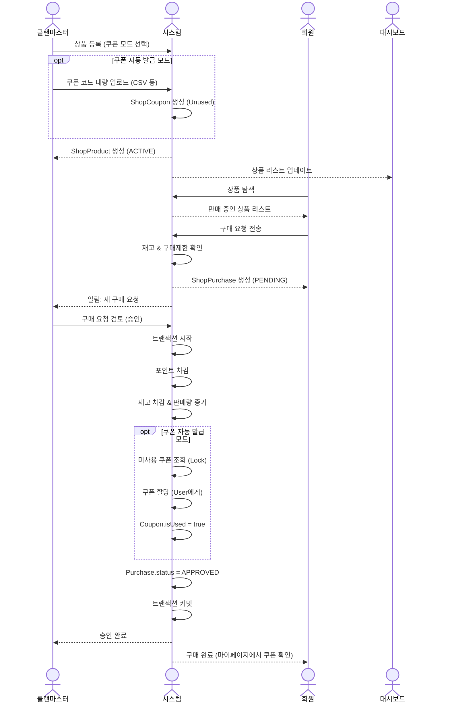

# 클랜 상점 시스템 프로세스 (Clan Shop System Process)

클랜마스터가 상품(기프티콘, 굿즈 등)을 등록하고, 회원들이 포인트로 구매하는 시스템입니다.
**쿠폰 자동 발급** 기능과 **구매 제한** 기능을 지원하여 운영 편의성을 높였습니다.

---

## 전체 흐름도 (Sequence Flow)



---

## 주요 엔티티 (Updated)

### ShopProduct (클랜 상품)

| 필드 | 타입 | 설명 |
|------|------|------|
| id | uuid | PK |
| category | enum | VOUCHER, GOODS, GAME_ITEM, ETC |
| name | string | 상품명 |
| price | int | 포인트 가격 |
| stock | int | 재고 수량 (쿠폰 모드 시 쿠폰 수와 동기화 권장) |
| purchaseLimit | int | **인당 구매 제한 (0: 무제한)** |
| status | enum | ACTIVE, INACTIVE, OUT_OF_STOCK |

### ShopCoupon (쿠폰 - 자동 발급용)

| 필드 | 타입 | 설명 |
|------|------|------|
| id | uuid | PK |
| productId | uuid | FK |
| code | string | 쿠폰 번호 (Unique) |
| isUsed | boolean | 사용(할당) 여부 |
| assignedTo | uuid | 할당받은 유저 ID (Nullable) |

---

## 프로세스 상세

### Phase 1: 상품 등록 및 쿠폰 관리

#### 1.1 상품 등록 (쿠폰 자동 발급)

**클랜마스터 작업:**
```typescript
async function createProductWithCoupons(data: CreateProductDto, codes: string[]) {
  return await db.transaction(async (trx) => {
    // 1. 상품 생성
    const product = await trx.shopProduct.create({
      ...data,
      stock: codes.length, // 쿠폰 개수만큼 재고 설정
      status: "ACTIVE"
    });

    // 2. 쿠폰 생성
    const coupons = codes.map(code => ({
      productId: product.id,
      code,
      isUsed: false
    }));
    
    await trx.shopCoupon.createMany({ data: coupons });
    
    return product;
  });
}
```

### Phase 2: 구매 요청 (구매 제한 체크)

#### 2.1 구매 요청

**회원 작업:**
```typescript
async function createPurchase(productId: string, userId: string, quantity: number) {
  const product = await findProduct(productId);
  
  // 1. 구매 제한 체크
  if (product.purchaseLimit > 0) {
    const myPurchases = await countMyApprovedPurchases(userId, productId);
    if (myPurchases + quantity > product.purchaseLimit) {
      throw new Error(`구매 제한을 초과했습니다. (인당 최대 ${product.purchaseLimit}개)`);
    }
  }

  // 2. 재고 체크
  if (product.stock < quantity) {
    throw new Error("재고 부족");
  }

  // 3. 요청 생성 (PENDING)
  // ...
}
```

### Phase 3: 구매 승인 (쿠폰 할당)

#### 3.1 승인 및 쿠폰 발급

**클랜마스터 작업 (시스템 자동 수행):**
```typescript
async function approvePurchase(purchaseId: string) {
  await db.transaction(async (trx) => {
    const purchase = await trx.shopPurchase.findById(purchaseId);
    const product = await trx.shopProduct.findById(purchase.productId);

    // ... (포인트 차감 로직 동일) ...

    // 쿠폰 할당 로직 (쿠폰 모드인 경우)
    if (product.category === 'VOUCHER') {
        const coupons = await trx.shopCoupon.findMany({
            where: { productId: product.id, isUsed: false },
            take: purchase.quantity,
            orderBy: { created_at: 'asc' } // 선입선출
        });

        if (coupons.length < purchase.quantity) {
            throw new Error("할당 가능한 쿠폰이 부족합니다.");
        }

        // 쿠폰 상태 업데이트
        for (const coupon of coupons) {
            await trx.shopCoupon.update({
                where: { id: coupon.id },
                data: { 
                    isUsed: true, 
                    assignedToUserId: purchase.userId,
                    assignedAt: new Date()
                }
            });
        }
    }

    // 재고 차감
    await trx.shopProduct.update({
        where: { id: product.id },
        data: { stock: { decrement: purchase.quantity } }
    });

    // 승인 완료
    await trx.shopPurchase.update({
        where: { id: purchaseId },
        data: { status: "APPROVED" }
    });
  });
}
```

### Phase 4: 마이페이지 (쿠폰 확인)

**회원 작업:**
```typescript
async function getMyCoupons(userId: string) {
    return await db.shopCoupon.findMany({
        where: { assignedToUserId: userId },
        include: { product: true }
    });
}
```
유저는 구매 승인 알림을 받으면, 마이페이지의 **[내 쿠폰함]**에서 즉시 핀 번호를 확인할 수 있습니다.