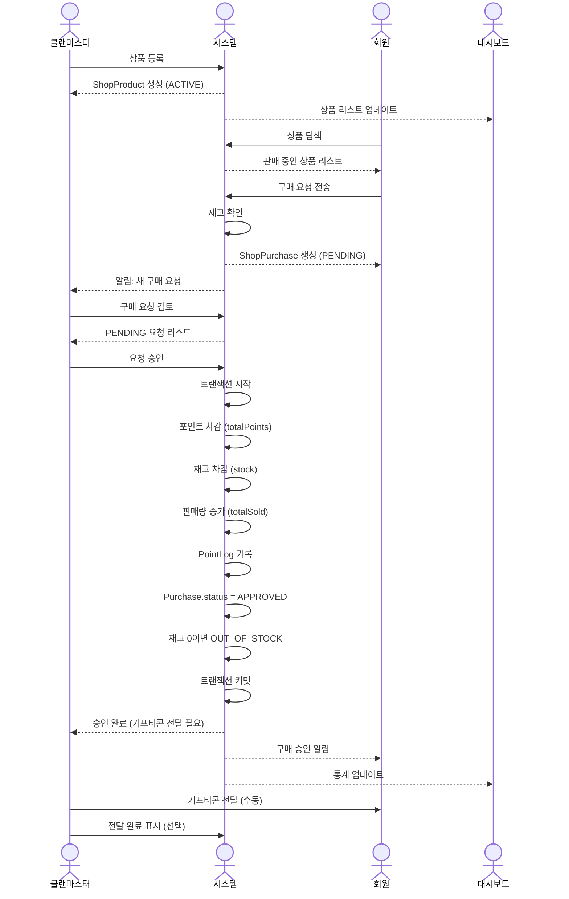
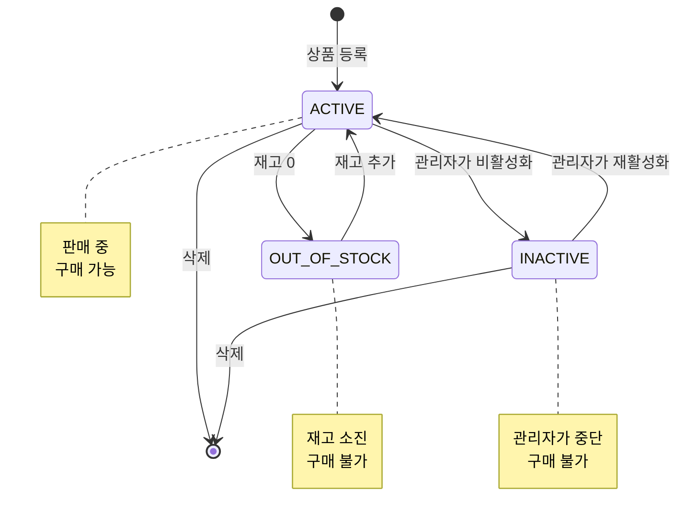
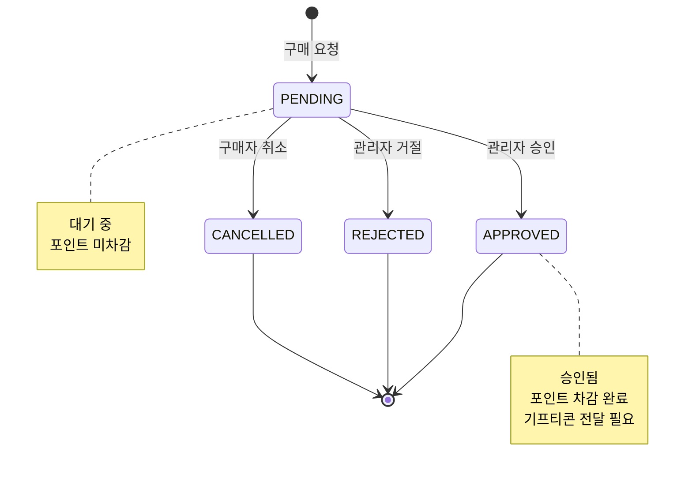

# 클랜 상점 시스템 프로세스 (Clan Shop System Process)

클랜마스터가 기프티콘 등 상품을 등록하고, 회원들이 포인트로 구매하는 클랜 내부 상점 시스템입니다.

---

## 전체 흐름도 (Sequence Flow)



---

## 상태 전이 다이어그램

### ShopProduct (상품) 상태



### ShopPurchase (구매) 상태



---

## 주요 엔티티

### ShopProduct (클랜 상품)

| 필드 | 타입 | 설명 |
|------|------|------|
| id | uuid | PK |
| clanId | uuid | FK - 소속 클랜 |
| name | string | 상품명 (예: 치킨 기프티콘) |
| description | string | 상품 설명 (Nullable) |
| price | int | 포인트 가격 |
| stock | int | 재고 수량 |
| imageUrl | string | 상품 이미지 (Nullable) |
| status | enum | ACTIVE, INACTIVE, OUT_OF_STOCK |
| totalSold | int | 총 판매량 (기본값: 0) |

**상태별 의미:**
- **ACTIVE**: 판매 중 (구매 가능)
- **INACTIVE**: 관리자가 비활성화 (구매 불가)
- **OUT_OF_STOCK**: 재고 소진 (구매 불가, 자동)

### ShopPurchase (구매 내역)

| 필드 | 타입 | 설명 |
|------|------|------|
| id | uuid | PK |
| productId | uuid | FK - 상품 |
| userId | uuid | FK - 구매자 |
| clanId | uuid | FK - 클랜 |
| quantity | int | 구매 수량 |
| totalPrice | int | 총 가격 |
| status | enum | PENDING, APPROVED, REJECTED, CANCELLED |
| adminNote | text | 관리자 메모 (Nullable) |
| approvedAt | timestamp | 승인 시각 (Nullable) |

**상태별 의미:**
- **PENDING**: 대기 중 (관리자가 검토, 포인트 미차감)
- **APPROVED**: 승인됨 (포인트 차감 완료, 기프티콘 전달 필요)
- **REJECTED**: 거절됨 (관리자가 거절)
- **CANCELLED**: 구매자가 취소

---

## 프로세스 상세

### Phase 1: 상품 등록 (클랜마스터)

#### 1.1 상품 등록

**클랜마스터 작업:**
```typescript
async function createProduct(data: CreateProductDto, clanId: string) {
  // 권한 체크
  const clanMember = await findClanMember({ userId: adminId, clanId });
  if (clanMember.clanRole !== "MANAGER") {
    throw new Error("권한이 없습니다. 클랜마스터만 상품을 등록할 수 있습니다.");
  }

  const product = await db.shopProduct.create({
    clanId,
    name: data.name,
    description: data.description,
    price: data.price,
    stock: data.stock,
    imageUrl: data.imageUrl,
    status: "ACTIVE",
    totalSold: 0
  });

  return product;
}
```

**상품 등록 예시:**
```json
{
  "name": "BBQ 치킨 기프티콘",
  "description": "1만원권 치킨 기프티콘",
  "price": 10000,
  "stock": 5,
  "imageUrl": "https://example.com/chicken.jpg"
}
```

#### 1.2 상품 수정

```typescript
async function updateProduct(productId: string, updates: Partial<Product>) {
  const product = await findProduct(productId);

  // 재고 증가 시 OUT_OF_STOCK → ACTIVE
  if (updates.stock && updates.stock > 0 && product.status === "OUT_OF_STOCK") {
    updates.status = "ACTIVE";
  }

  await db.shopProduct.update({
    where: { id: productId },
    data: updates
  });
}
```

#### 1.3 상품 비활성화/활성화

```typescript
async function toggleProductStatus(productId: string) {
  const product = await findProduct(productId);

  const newStatus = product.status === "ACTIVE" ? "INACTIVE" : "ACTIVE";

  await db.shopProduct.update({
    where: { id: productId },
    data: { status: newStatus }
  });
}
```

---

### Phase 2: 상품 구매 (회원)

#### 2.1 상품 탐색

**회원 작업:**
```typescript
async function findProducts(clanId: string, filters?: ProductFilter) {
  const products = await db.shopProduct.findMany({
    where: {
      clanId,
      status: "ACTIVE",  // 판매 중인 상품만
      ...(filters?.minPrice && { price: { gte: filters.minPrice } }),
      ...(filters?.maxPrice && { price: { lte: filters.maxPrice } })
    },
    orderBy: [
      { totalSold: "desc" },  // 인기순
      { created_at: "desc" }  // 최신순
    ]
  });

  return products;
}
```

#### 2.2 구매 요청

**회원 작업:**
```typescript
async function createPurchase(
  productId: string,
  userId: string,
  quantity: number = 1
) {
  const product = await findProduct(productId);
  const user = await findClanMember({ userId, clanId: product.clanId });

  // 상태 체크
  if (product.status !== "ACTIVE") {
    throw new Error("현재 구매할 수 없는 상품입니다.");
  }

  // 재고 확인
  if (product.stock < quantity) {
    throw new Error(`재고가 부족합니다. (남은 재고: ${product.stock}개)`);
  }

  // 총 가격 계산
  const totalPrice = product.price * quantity;

  // 가용 포인트 확인 (승인 시 차감되지만 미리 체크)
  const availablePoints = user.totalPoints - user.lockedPoints;
  if (availablePoints < totalPrice) {
    throw new Error(
      `포인트가 부족합니다. (보유: ${availablePoints}P, 필요: ${totalPrice}P)`
    );
  }

  // 구매 요청 생성
  const purchase = await db.shopPurchase.create({
    productId,
    userId,
    clanId: product.clanId,
    quantity,
    totalPrice,
    status: "PENDING"
  });

  // 클랜마스터에게 알림
  await notifyManagers(product.clanId, "새로운 구매 요청이 도착했습니다.");

  return purchase;
}
```

#### 2.3 구매 취소

**회원 작업:**
```typescript
async function cancelPurchase(purchaseId: string, userId: string) {
  const purchase = await findPurchase(purchaseId);

  // 권한 체크
  if (purchase.userId !== userId) {
    throw new Error("권한이 없습니다.");
  }

  // 상태 체크
  if (purchase.status !== "PENDING") {
    throw new Error("이미 처리된 구매는 취소할 수 없습니다.");
  }

  // 취소 처리
  await db.shopPurchase.update({
    where: { id: purchaseId },
    data: { status: "CANCELLED" }
  });
}
```

---

### Phase 3: 구매 승인 (클랜마스터)

#### 3.1 구매 요청 확인

**클랜마스터 작업:**
```typescript
async function findPendingPurchases(clanId: string) {
  const purchases = await db.shopPurchase.findMany({
    where: {
      clanId,
      status: "PENDING"
    },
    include: {
      user: {
        select: { battleTag: true }
      },
      product: {
        select: { name: true, price: true, stock: true }
      }
    },
    orderBy: { created_at: "asc" }
  });

  return purchases;
}
```

#### 3.2 구매 승인

**클랜마스터 작업:**
```typescript
async function approvePurchase(purchaseId: string, adminId: string) {
  await db.transaction(async (trx) => {
    // 구매 조회 (Row Lock)
    const purchase = await trx.shopPurchase
      .where({ id: purchaseId })
      .forUpdate()
      .first();

    if (!purchase) {
      throw new Error("구매 내역을 찾을 수 없습니다.");
    }

    // 상품 조회 (Row Lock)
    const product = await trx.shopProduct
      .where({ id: purchase.productId })
      .forUpdate()
      .first();

    // 권한 체크
    const admin = await trx.clanMember.findFirst({
      where: { userId: adminId, clanId: product.clanId }
    });

    if (admin.clanRole !== "MANAGER") {
      throw new Error("권한이 없습니다.");
    }

    // 상태 체크
    if (purchase.status !== "PENDING") {
      throw new Error("이미 처리된 구매입니다.");
    }

    // 재고 재확인
    if (product.stock < purchase.quantity) {
      throw new Error(
        `재고가 부족합니다. (남은 재고: ${product.stock}개, 요청: ${purchase.quantity}개)`
      );
    }

    // 회원 조회
    const buyer = await trx.clanMember.findFirst({
      where: { userId: purchase.userId, clanId: product.clanId }
    });

    // 가용 포인트 재확인
    const availablePoints = buyer.totalPoints - buyer.lockedPoints;
    if (availablePoints < purchase.totalPrice) {
      throw new Error(
        `구매자의 포인트가 부족합니다. (보유: ${availablePoints}P, 필요: ${purchase.totalPrice}P)`
      );
    }

    // 1. 포인트 차감
    await trx.clanMember
      .where({ userId: purchase.userId, clanId: product.clanId })
      .decrement("totalPoints", purchase.totalPrice);

    // 2. 포인트 로그
    await trx.pointLog.create({
      userId: purchase.userId,
      clanId: product.clanId,
      amount: -purchase.totalPrice,
      reason: `상품 구매: ${product.name} (${purchase.quantity}개)`
    });

    // 3. 재고 차감
    await trx.shopProduct
      .where({ id: product.id })
      .decrement("stock", purchase.quantity);

    // 4. 판매량 증가
    await trx.shopProduct
      .where({ id: product.id })
      .increment("totalSold", purchase.quantity);

    // 5. 재고 0이면 OUT_OF_STOCK
    const updatedProduct = await trx.shopProduct.findUnique({
      where: { id: product.id }
    });

    if (updatedProduct.stock === 0) {
      await trx.shopProduct
        .where({ id: product.id })
        .update({ status: "OUT_OF_STOCK" });
    }

    // 6. 구매 승인
    await trx.shopPurchase
      .where({ id: purchaseId })
      .update({
        status: "APPROVED",
        approvedAt: new Date()
      });
  });

  // 알림
  await notifyUser(
    purchase.userId,
    `구매가 승인되었습니다: ${product.name}`
  );
}
```

#### 3.3 구매 거절

**클랜마스터 작업:**
```typescript
async function rejectPurchase(
  purchaseId: string,
  adminId: string,
  reason?: string
) {
  const purchase = await findPurchase(purchaseId);
  const product = await findProduct(purchase.productId);

  // 권한 체크
  const admin = await findClanMember({ userId: adminId, clanId: product.clanId });
  if (admin.clanRole !== "MANAGER") {
    throw new Error("권한이 없습니다.");
  }

  // 상태 체크
  if (purchase.status !== "PENDING") {
    throw new Error("이미 처리된 구매입니다.");
  }

  // 거절 처리
  await db.shopPurchase.update({
    where: { id: purchaseId },
    data: {
      status: "REJECTED",
      adminNote: reason
    }
  });

  // 알림
  await notifyUser(
    purchase.userId,
    `구매가 거절되었습니다: ${product.name}${reason ? ` (사유: ${reason})` : ""}`
  );
}
```

---

### Phase 4: 통계 및 대시보드

#### 4.1 구매 내역 (전체 공개)

```typescript
async function findPurchaseHistory(clanId: string, filters?: PurchaseFilter) {
  const purchases = await db.shopPurchase.findMany({
    where: {
      clanId,
      status: "APPROVED",  // 승인된 구매만
      ...(filters?.productId && { productId: filters.productId }),
      ...(filters?.userId && { userId: filters.userId })
    },
    include: {
      user: {
        select: { battleTag: true }
      },
      product: {
        select: { name: true }
      }
    },
    orderBy: { approvedAt: "desc" }
  });

  return purchases;
}
```

**공개 정보:**
- 누가 (battleTag)
- 무엇을 (product.name)
- 얼마에 (totalPrice)
- 언제 (approvedAt)
- 몇 개 (quantity)

#### 4.2 상점 통계

```typescript
async function getShopStats(clanId: string) {
  const products = await db.shopProduct.findMany({
    where: { clanId }
  });

  const purchases = await db.shopPurchase.findMany({
    where: { clanId, status: "APPROVED" }
  });

  const totalRevenue = purchases.reduce((sum, p) => sum + p.totalPrice, 0);
  const totalSales = purchases.reduce((sum, p) => sum + p.quantity, 0);

  return {
    totalProducts: products.length,
    activeProducts: products.filter(p => p.status === "ACTIVE").length,
    totalRevenue,        // 총 거래액 (포인트)
    totalSales,          // 총 판매 수량
    topProducts: products
      .sort((a, b) => b.totalSold - a.totalSold)
      .slice(0, 5),      // 인기 상품 TOP 5
    recentPurchases: purchases
      .sort((a, b) => new Date(b.approvedAt) - new Date(a.approvedAt))
      .slice(0, 10)      // 최근 구매 10건
  };
}
```

#### 4.3 개인 구매 내역

```typescript
async function getMyPurchases(userId: string, clanId: string) {
  const purchases = await db.shopPurchase.findMany({
    where: {
      userId,
      clanId
    },
    include: {
      product: {
        select: { name: true, price: true }
      }
    },
    orderBy: { created_at: "desc" }
  });

  const totalSpent = purchases
    .filter(p => p.status === "APPROVED")
    .reduce((sum, p) => sum + p.totalPrice, 0);

  return {
    purchases,
    totalSpent,           // 총 사용 포인트
    totalPurchases: purchases.filter(p => p.status === "APPROVED").length
  };
}
```

---

## 주요 특징

### 1. 승인 후 차감 방식

```
구매 요청 (PENDING) → 포인트 미차감
      ↓
관리자 승인 (APPROVED) → 포인트 차감 + 재고 차감
```

- 요청 시점: 가용 포인트 확인만
- 승인 시점: 실제 포인트 차감
- 취소/거절: 포인트 변동 없음

### 2. 재고 관리

**자동 재고 관리:**
```typescript
// 구매 승인 시
stock -= quantity;

if (stock === 0) {
  status = "OUT_OF_STOCK";
}
```

**재고 추가:**
```typescript
// 관리자가 재고 추가
stock += additionalStock;

if (status === "OUT_OF_STOCK") {
  status = "ACTIVE";
}
```

### 3. 포인트 생태계 통합

**포인트 획득:**
- 베팅 승리
- 경매 수익
- 소개팅 매칭 성공

**포인트 사용:**
- 베팅
- 경매 입찰
- **상점 구매** ← 새로운 사용 수단

### 4. 전체 공개 대시보드

**공개 정보:**
- 누가 무엇을 샀는지
- 언제 구매했는지
- 얼마에 구매했는지

**비공개 정보:**
- 관리자 메모 (adminNote)
- 거절 사유 (본인만 확인)

---

## 엣지 케이스 처리

### 1. 동시 구매 시 재고 부족

```typescript
// Row Lock으로 동시성 제어
await trx.shopProduct
  .where({ id: productId })
  .forUpdate()
  .first();

// 재고 재확인
if (product.stock < purchase.quantity) {
  throw new Error("재고가 부족합니다.");
}
```

### 2. 승인 중 포인트 부족

```typescript
// 승인 시점에 가용 포인트 재확인
const availablePoints = buyer.totalPoints - buyer.lockedPoints;

if (availablePoints < purchase.totalPrice) {
  throw new Error("구매자의 포인트가 부족합니다.");
}
```

### 3. 상품 삭제 시 PENDING 구매 처리

```typescript
async function deleteProduct(productId: string) {
  const pendingPurchases = await findPurchases({
    productId,
    status: "PENDING"
  });

  if (pendingPurchases.length > 0) {
    throw new Error(
      "대기 중인 구매 요청이 있어 삭제할 수 없습니다. 먼저 모든 요청을 처리해주세요."
    );
  }

  // 삭제 진행...
}
```

### 4. 클랜 탈퇴 시 PENDING 구매 처리

```typescript
async function leaveClan(userId: string, clanId: string) {
  const pendingPurchases = await findPurchases({
    userId,
    clanId,
    status: "PENDING"
  });

  if (pendingPurchases.length > 0) {
    throw new Error(
      "대기 중인 구매 요청이 있어 탈퇴할 수 없습니다. 먼저 요청을 취소해주세요."
    );
  }

  // 탈퇴 진행...
}
```

---

## API 엔드포인트 예시

### 상품 관리 (클랜마스터)

```
POST   /api/clans/:clanId/shop/products           # 상품 등록
PATCH  /api/clans/:clanId/shop/products/:id       # 상품 수정
DELETE /api/clans/:clanId/shop/products/:id       # 상품 삭제
PATCH  /api/clans/:clanId/shop/products/:id/toggle  # 활성화/비활성화
```

### 상품 조회

```
GET    /api/clans/:clanId/shop/products           # 상품 리스트
GET    /api/clans/:clanId/shop/products/:id       # 상품 상세
```

### 구매 (회원)

```
POST   /api/clans/:clanId/shop/purchases          # 구매 요청
PATCH  /api/clans/:clanId/shop/purchases/:id/cancel  # 구매 취소
GET    /api/clans/:clanId/shop/purchases/my       # 내 구매 내역
```

### 구매 관리 (클랜마스터)

```
GET    /api/clans/:clanId/shop/purchases/pending  # 대기 중인 구매
PATCH  /api/clans/:clanId/shop/purchases/:id/approve  # 승인
PATCH  /api/clans/:clanId/shop/purchases/:id/reject   # 거절
```

### 통계

```
GET    /api/clans/:clanId/shop/stats              # 상점 통계
GET    /api/clans/:clanId/shop/purchases          # 전체 구매 내역
```

---

## 관련 문서

- **플로우차트:** [FLOW.mmd](./FLOW.mmd)
- **관리자 플로우:** [ADMIN_FLOW.mmd](./ADMIN_FLOW.mmd)
- **엣지 케이스 시뮬레이션:** [SIMULATION.md](./SIMULATION.md)
- **ERD:** [docs/common/ERD.mmd](../common/ERD.mmd)
