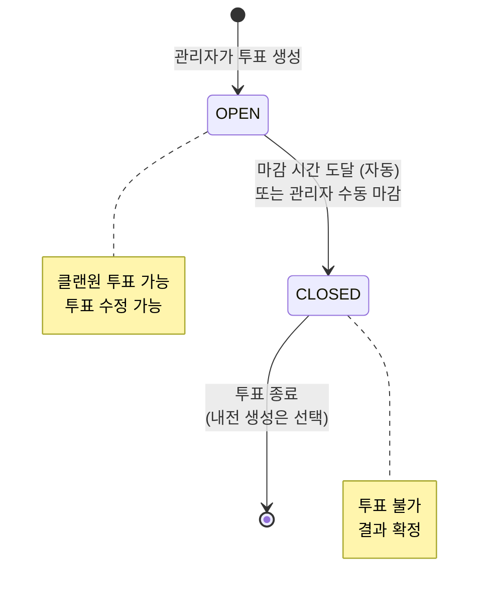
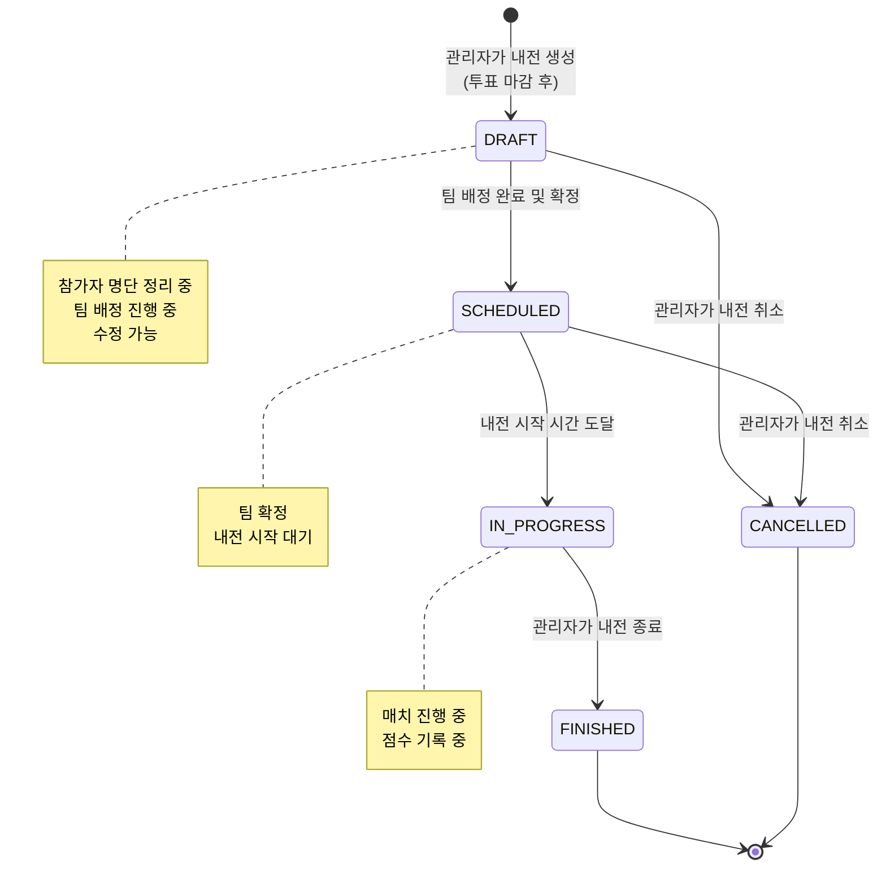
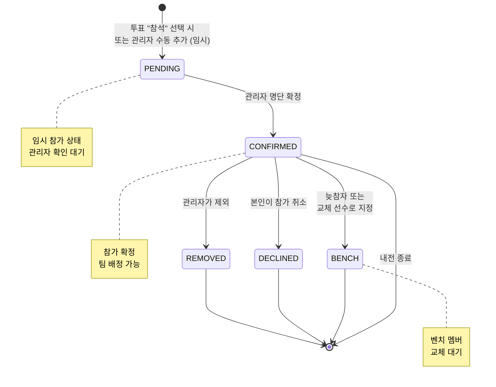

# 투표 기반 내전 생성 프로세스 (Vote-based Scrim Creation Process)

이 문서는 클랜 내전 참가자 투표부터 내전 생성, 팀 배정까지의 전체 프로세스를 정의합니다.

## 1. 전체 흐름도 (Process Overview)

```mermaid
sequenceDiagram
    participant Admin as 관리자 (MANAGER)
    participant System as POTG 시스템
    participant Member as 클랜원 (Member)

    %% Phase 1: 투표 생성 및 진행
    rect rgb(255, 240, 245)
    Note over Admin, Member: [Phase 1] 투표 생성 및 진행
    Admin->>System: 내전 투표 생성
    Note over Admin: 제목: "12월 15일 내전 참가 투표"<br/>마감: 12월 12일 23:59
    System->>System: Vote 생성 (status: OPEN)
    System->>System: VoteOption 생성 ("참석", "불참", "늦참")
    System-->>Member: [Push] 투표 시작 알림

    Member->>System: 투표 페이지 접근
    System-->>Member: 투표 옵션 표시
    Member->>System: "참석" 투표
    System->>System: VoteRecord 생성
    System-->>Member: 투표 완료

    opt 투표 수정
        Member->>System: 투표 변경 ("참석" → "늦참")
        System->>System: VoteRecord 업데이트
    end

    Note over System: 마감 시간 도달 (12월 12일 23:59)
    System->>System: Vote.status = CLOSED
    System-->>Admin: 투표 마감 알림
    end

    %% Phase 2: 명단 확인 및 정리
    rect rgb(230, 245, 255)
    Note over Admin, Member: [Phase 2] 참가자 명단 확인 및 정리
    Admin->>System: 투표 결과 확인
    System-->>Admin: "참석" 15명, "늦참" 3명, "불참" 7명

    Admin->>System: 내전 생성 (DRAFT 상태)
    Note over Admin: 제목: "12월 15일 5vs5 내전"<br/>일시: 12월 15일 20:00<br/>모집 방식: VOTE
    System->>System: Scrim 생성<br/>(status: DRAFT, recruitmentType: VOTE)
    System->>System: VoteRecord 기반 ScrimParticipant 자동 생성
    Note over System: "참석" 투표자 → status: CONFIRMED<br/>"늦참" 투표자 → assignedTeam: BENCH

    Admin->>System: 명단 수정
    Note over Admin: 참가자 추가/제외

    alt 참가자 추가
        Admin->>System: 투표 안한 사람 수동 추가
        System->>System: ScrimParticipant 생성 (source: MANUAL)
    end

    alt 참가자 제외
        Admin->>System: 급한 일 생긴 사람 제외
        System->>System: ScrimParticipant.status = REMOVED
    end

    System-->>Admin: 최종 참가자 16명 확정
    end

    %% Phase 3: 팀 배정
    rect rgb(255, 250, 230)
    Note over Admin, Member: [Phase 3] 팀 배정 (수동)
    Admin->>System: 팀 배정 페이지 진입
    System-->>Admin: 참가자 리스트 표시<br/>(레이팅, 포지션 표시)

    loop 드래그앤드롭으로 배정
        Admin->>System: 참가자를 TEAM_A 또는 TEAM_B로 드래그
        System->>System: ScrimParticipant.assignedTeam 업데이트
    end

    Admin->>System: 밸런스 확인
    System-->>Admin: TEAM_A 평균 레이팅: 3250<br/>TEAM_B 평균 레이팅: 3230

    opt 밸런스 재조정
        Admin->>System: 일부 선수 교체
        System->>System: assignedTeam 업데이트
    end

    Admin->>System: 팀 배정 확정
    System->>System: Scrim.status = SCHEDULED
    System->>System: Scrim.teamSnapshot 업데이트
    System-->>Member: [Push] 내전 확정 알림 (팀 배정 결과)
    end

    %% Phase 4: 내전 진행
    rect rgb(230, 255, 230)
    Note over Admin, Member: [Phase 4] 내전 진행
    Note over System: 내전 시작 시간 도달
    Admin->>System: 내전 시작
    System->>System: Scrim.status = IN_PROGRESS

    Note over Member: 내전 진행 중...

    Admin->>System: 매치별 결과 입력
    System->>System: ScrimMatch 생성 (맵, 점수 기록)

    Admin->>System: 내전 종료
    System->>System: Scrim.status = FINISHED
    System-->>Member: [Push] 내전 완료 알림 (최종 점수)
    end
```



## 2. 상태 전이 (Status Transitions)

### 2.1 Vote 상태 전이



### 2.2 Scrim 상태 전이 (투표 기반)



### 2.3 ScrimParticipant 상태 전이



## 3. 주요 엔티티

### Vote
```typescript
{
  id: uuid
  clanId: uuid              // FK → Clan
  creatorId: uuid           // FK → User (MANAGER)
  title: string             // "12월 15일 내전 참가 투표"
  deadline: timestamp       // 마감 시간
  status: enum              // OPEN, CLOSED
  scrimType: enum           // NORMAL (일반내전), AUCTION (경매내전)
  multipleChoice: boolean   // 다중 선택 가능 여부
  anonymous: boolean        // 익명 투표 여부
  created_at: timestamp
  updated_at: timestamp
}
```

### VoteOption
```typescript
{
  id: uuid
  voteId: uuid              // FK → Vote
  label: string             // "참석", "불참", "늦참"
  count: int                // 투표 수
}
```

### VoteRecord
```typescript
{
  id: uuid
  voteId: uuid              // FK → Vote
  userId: uuid              // FK → User
  optionId: uuid            // FK → VoteOption
  created_at: timestamp
}
```

### Scrim (투표 기반)
```typescript
{
  id: uuid
  clanId: uuid              // FK → Clan (Nullable)
  voteId: uuid              // FK → Vote (투표 기반일 경우)
  auctionId: uuid           // null (투표 기반은 경매 없음)
  title: string             // "12월 15일 5vs5 내전"
  status: enum              // DRAFT, SCHEDULED, IN_PROGRESS, FINISHED, CANCELLED
  recruitmentType: enum     // "VOTE" (투표 기반)
  hostId: uuid              // FK → User (주최자)
  scheduledDate: timestamp  // 내전 시작 예정 시간
  teamSnapshot: jsonb       // 팀 배정 결과 (확정 후 저장)
  teamAScore: int
  teamBScore: int
  created_at: timestamp
  updated_at: timestamp
}
```

### ScrimParticipant
```typescript
{
  id: uuid
  scrimId: uuid             // FK → Scrim
  userId: uuid              // FK → User
  source: enum              // "VOTE" (투표로 참가) / "MANUAL" (수동 추가)
  status: enum              // PENDING, CONFIRMED, BENCH, DECLINED, REMOVED
  assignedTeam: enum        // TEAM_A, TEAM_B, BENCH, UNASSIGNED
  created_at: timestamp
  updated_at: timestamp
}
```

## 4. 프로세스 상세

### Phase 1: 투표 생성 및 진행

**1.1 투표 생성 (관리자)**
```typescript
// 입력 데이터
{
  title: "12월 15일 내전 참가 투표",
  deadline: "2024-12-12T23:59:59Z",
  scrimType: "NORMAL",  // or "AUCTION" - 일반내전 or 경매내전 선택
  multipleChoice: false,  // 단일 선택
  anonymous: false        // 공개 투표
}

// 자동 생성되는 VoteOption
options: [
  { label: "참석" },
  { label: "불참" },
  { label: "늦참" }
]
```

**scrimType 선택:**
- **NORMAL (일반내전)**: 투표 마감 후 내전 마스터가 팀 생성 및 배정
- **AUCTION (경매내전)**: 투표 마감 후 경매 진행 → 낙찰 결과 기반 명단 집계 → 내전 마스터가 팀 생성 및 배정


**1.2 클랜원 투표**
- 마감 전까지 투표 가능
- 투표 수정 가능 (VoteRecord UPDATE)
- 익명 여부에 따라 투표자 표시

**1.3 투표 마감**
- 시스템 자동 마감: `deadline` 도달 시
- 수동 마감: 관리자가 조기 마감 가능
- 마감 후: `Vote.status = CLOSED`
- **내전 생성 버튼 활성화** (관리자만 보임)

---

### Phase 2: 명단 확인 및 정리

**2.1 내전 생성 (수동 - 마스터 클릭)**

**중요:** 투표 마감 후 자동으로 내전이 생성되지 않습니다!
→ 내전 마스터가 "내전 생성" 버튼을 **수동으로 클릭**해야 합니다.

```typescript
// 마스터가 입력
{
  voteId: "vote-uuid",
  title: "12월 15일 5vs5 내전",
  scheduledDate: "2024-12-15T20:00:00Z",
  recruitmentType: "VOTE"
}

// Scrim 생성
→ status: DRAFT
→ voteId: vote-uuid (투표 참조)
```

**2.2 ScrimParticipant 자동 생성**
```typescript
// 투표 결과 기반 자동 생성
const attendRecords = await findVoteRecords(voteId, "참석");
const lateRecords = await findVoteRecords(voteId, "늦참");

// "참석" 투표자
for (const record of attendRecords) {
  await createScrimParticipant({
    scrimId,
    userId: record.userId,
    source: "VOTE",
    status: "CONFIRMED",
    assignedTeam: "UNASSIGNED"  // 팀 배정 전
  });
}

// "늦참" 투표자
for (const record of lateRecords) {
  await createScrimParticipant({
    scrimId,
    userId: record.userId,
    source: "VOTE",
    status: "CONFIRMED",
    assignedTeam: "BENCH"  // 벤치로 자동 배정
  });
}
```

**2.3 명단 수정**

**참가자 추가 (수동):**
```typescript
// 투표 안한 사람 추가
await createScrimParticipant({
  scrimId,
  userId: "user-uuid",
  source: "MANUAL",  // 수동 추가
  status: "CONFIRMED",
  assignedTeam: "UNASSIGNED"
});
```

**참가자 제외:**
```typescript
// 급한 일 생긴 사람 제외
await updateScrimParticipant(participantId, {
  status: "REMOVED"
});
```

---

### Phase 3: 팀 배정 (수동 - 내전 마스터가 직접 배정)

**중요:** 팀 생성 및 배정은 자동화되지 않습니다!
→ 내전 마스터가 **드래그앤드롭으로 직접 배정**합니다.
→ 오버워치 기본: **5vs5** (각 팀 5명)

**3.1 관리자 UI**
- 참가자 리스트 표시 (레이팅, 포지션 표시)
- 드래그앤드롭으로 TEAM_A, TEAM_B, BENCH로 배정
- 실시간 밸런스 계산 (평균 레이팅 표시)

**3.2 팀 배정 로직**
```typescript
// 드래그앤드롭 시
async function assignTeam(participantId, team) {
  await updateScrimParticipant(participantId, {
    assignedTeam: team  // "TEAM_A" or "TEAM_B" or "BENCH"
  });
}

// 밸런스 계산
async function calculateBalance(scrimId) {
  const teamA = await getParticipants(scrimId, "TEAM_A");
  const teamB = await getParticipants(scrimId, "TEAM_B");

  const avgRatingA = teamA.reduce((sum, p) => sum + p.user.rating, 0) / teamA.length;
  const avgRatingB = teamB.reduce((sum, p) => sum + p.user.rating, 0) / teamB.length;

  return { avgRatingA, avgRatingB, diff: Math.abs(avgRatingA - avgRatingB) };
}
```

**3.3 팀 확정**
```typescript
// 팀 배정 완료 후
await db.transaction(async (trx) => {
  // teamSnapshot 생성
  const participants = await getParticipants(scrimId);
  const teamSnapshot = {
    recruitmentType: "vote",
    sourceId: voteId,
    teamA: {
      players: participants.filter(p => p.assignedTeam === "TEAM_A")
        .map(p => ({
          userId: p.userId,
          battleTag: p.user.battleTag,
          role: p.user.mainRole,
          rating: p.user.rating
        }))
    },
    teamB: { /* 동일 */ },
    bench: participants.filter(p => p.assignedTeam === "BENCH").map(/* ... */),
    snapshotAt: new Date().toISOString()
  };

  // Scrim 업데이트
  await updateScrim(scrimId, {
    status: "SCHEDULED",
    teamSnapshot
  }, trx);
});
```

---

### Phase 4: 내전 진행

**4.1 내전 시작**
- `Scrim.status = IN_PROGRESS`
- 매치별 점수 기록 (ScrimMatch)

**4.2 내전 종료**
- `Scrim.status = FINISHED`
- 최종 점수 확정
- 베팅 정산 (BettingQuestion이 있는 경우)

## 5. 주요 특징

### ✅ 비선형 타임라인 지원
- 투표 마감(D-3) → 명단 정리(D-2) → 팀 배정(D-1) → 내전 시작(D-Day)
- DRAFT 상태로 중간 준비 단계 명확화
- 각 단계별 시간 여유 확보

### ✅ 유연한 참가자 관리
- 투표 결과 자동 반영 (ScrimParticipant 자동 생성)
- 명단 수정 가능 (추가/제외)
- 늦참자 자동 벤치 배정

### ✅ 수동 팀 배정
- 관리자가 드래그앤드롭으로 배정
- 실시간 밸런스 확인 (레이팅 평균)
- 포지션 고려 가능

### ✅ 투표 이력 추적
- VoteRecord로 누가 언제 투표했는지 기록
- 투표 변경 이력 (UPDATE 시간)
- 익명/공개 투표 선택 가능

### ✅ 다른 생성 방식과 통합
- 경매 기반: `recruitmentType: "AUCTION"`
- 수동 생성: `recruitmentType: "MANUAL"`
- ScrimParticipant로 통합 관리

## 6. 엣지 케이스 처리

### 6.1 참가자 0명일 때
```
투표 "참석" 0명 → 내전 생성 불가
→ 관리자에게 경고 표시
→ MANUAL로 참가자 추가 필요
```

### 6.2 투표 후 모두 제외할 때
```
명단 정리 중 모두 REMOVED
→ ScrimParticipant.status = CONFIRMED인 사람 0명
→ 내전 확정 불가 (SCHEDULED 전환 차단)
```

### 6.3 늦참자만 있을 때
```
"참석" 0명, "늦참" 5명
→ ScrimParticipant.assignedTeam = BENCH만 존재
→ 관리자가 BENCH → TEAM_A/B로 수동 배정 필요
```

### 6.4 홀수 인원일 때
```
참가자 15명 → TEAM_A 8명, TEAM_B 7명 (또는 7vs7 + 벤치 1명)
→ 관리자가 직접 결정
→ 밸런스 경고 표시
```

## 7. 프로세스 플로우차트

- **클랜원 플로우:** [VOTE_FLOW.mmd](./VOTE_FLOW.mmd)
- **관리자 플로우:** [ADMIN_FLOW.mmd](./ADMIN_FLOW.mmd)
